# minicurso de seleccion

El presente son los apuntes asociados al curso de fundamentos exsigido por IBM, el cual es obligatorio para participar
por la Beca completa del Bootcamp ade analitica de datos.

se deben desarrollar las siguientes tareas con una duracion de 16hrs

## crear la cuenta en credly

ya la tenia <https://www.credly.com/users/ojsilvera/badges>

A continuacion el desarrollo de los modulos obligatorios como prerequisito para participar por la beca.

## Explorar tecnologia emergente

### Ciencia de datos (datos y análisis)

#### Que es la ciencia de datos?

##### Todo es cuestión de información

**Exploremos la ciencia de datos.**

Nuestro mundo es rico en datos . Los científicos de datos dan sentido a los datos y los utilizan para resolver problemas.

Antes de profundizar, intente esta pregunta de preparación. Si no sabes la respuesta, haz tu mejor estimación. Aquí va...

¿Crees que los “datos no estructurados” son:

    - Aún no organizado
    - Imposible de analizar
    - Difícil de encajar en una mesa.
    - Inútil

Tenga en cuenta su mejor suposición. ¡Encontrarás la respuesta más adelante en este módulo!

Para comenzar con la ciencia de datos, aquí hay un video breve que explora el campo desde diferentes perspectivas.

<https://youtu.be/f9AqD83qHGg>

##### Como manejas los datos?

**Puedes organizar los datos de dos maneras diferentes.**

Los datos son información cruda. Pueden ser hechos, estadísticas, opiniones o cualquier tipo de contenido registrado en
algún formato. ¿Números? Seguro. ¿Hechos? Seguro. ¿Voces, fotos, nombres, pasos de baile? También datos.

Entonces, cuando los científicos de datos manejan información en bruto para descubrir su historia, comienzan por organizarla
en una de dos formas:  datos estructurados o datos no estructurados . La diferencia entre estas formas cambia la forma en
que trabajamos con ellas.

*Datos estructurados.*

Los datos estructurados son información que se puede distribuir en filas y columnas. Es posible que ya haya trabajado con
datos estructurados utilizando una hoja de cálculo como Microsoft Excel. Para información compleja, los científicos de datos
utilizan herramientas más potentes como SQL, Apache o R, que pueden clasificar grandes cantidades de datos almacenados en
muchas tablas conectadas. ¿Puedes organizar la información dentro de los datos en grupos según características específicas?
Esos grupos son datos estructurados.

A continuación se muestra una muestra de datos estructurados de su ferretería local.

Esta tabla organiza la información del cliente de la ferretería por características como número o nombre del cliente. Cada
fila muestra información relacionada con un cliente en particular, mientras que cada columna muestra una característica del
cliente que abarca un grupo de clientes.

Como puede ver, los datos estructurados tienden a estar bien organizados, lo que facilita a los científicos de datos
descubrir su tesoro utilizando herramientas comunes de análisis de datos. Las hojas de cálculo se basan en tablas como esta,
por lo que manejan muy bien datos estructurados.

*Datos no estructurados.*

Luego están los datos no estructurados, que es una forma elegante de decir "todo lo demás". Usamos este término cuando los
datos no tienen una organización (o estructura) incorporada. Los datos no estructurados pueden ser una colección de archivos
de audio, publicaciones en redes sociales, textos de ensayos o incluso letras de canciones.

Aquí hay dos ejemplos para ayudarle a ver la diferencia:

Su Departamento de Vehículos Motorizados toma fotografías de todas las personas que obtienen una licencia de conducir. Una
colección de esas imágenes son  datos no estructurados . (Pero la tabla de nombres, direcciones y números de licencia de las
personas que indexa esas fotos son datos estructurados).

Una biblioteca descargable puede ofrecer texto de miles de libros diferentes. El catálogo que enumera los nombres, autores y
fechas de esos libros son datos estructurados . (Pero el texto de esos libros son datos no estructurados).

Puede ser más difícil trabajar con datos no estructurados que con datos estructurados, ¡pero sigue siendo útil! Supongamos
que una empresa de videojuegos recibe muchos informes de errores por correo electrónico sobre un nuevo lanzamiento. El texto
de esos correos electrónicos son datos no estructurados. Al examinar esos textos (y tal vez al convertir parte de su
contenido en datos estructurados), un científico de datos puede descubrir patrones e identificar el problema para que la
empresa pueda solucionarlo.

##### Como convertirse en cientifico de datos?

**Cuál es el camino hacia este campo?**

En un tema anterior, viste a jóvenes profesionales hablar sobre ciencia de datos. ¿Notaste que nadie llegó a este campo de
la misma manera? Esto se debe a que la ciencia de datos es un estudio emergente que no se ha definido claramente hasta hace
poco. (Y, en algunas áreas, la definición todavía está cambiando).

Es útil pensar en la ciencia de datos como una creación de conocimiento a partir de datos , sin importar qué técnica se
utilice para analizar los datos. Es como una búsqueda del tesoro. Comienza con texto sin formato, números, gráficos o
cualquier otro tipo de datos, y explora esos datos para descubrir patrones e ideas valiosas.

Ninguna certificación o conjunto de habilidades especiales lo califica como científico de datos. Simplemente comience a
analizar datos en cualquiera de sus muchas formas. Si utilizas técnicas científicas para derivar información de los datos,
eres un científico de datos, ¡sin importar cómo ingresaste al campo! Pero hay áreas de estudio que pueden ayudarle a
prepararse para buscar tesoros de datos y las veremos más adelante en este curso.

En el siguiente video, aprenderá cómo los diferentes caminos pueden llevarlo a este destino profesional.

<https://youtu.be/tM88Bo5S83s>

##### ¿Te gustará el trabajo? cazando tesoros

**Es una búsqueda de comprensión.**

El siguiente vídeo proporciona un sólido punto de vista sobre las cualidades que debe tener un científico de datos, incluida
la curiosidad, la pasión y la capacidad de contar una historia.

<https://youtu.be/hpapzldt6DE>

*¿Podrías ser un científico de datos?*

Ahora que sabes más sobre ciencia de datos y cómo es el trabajo, ¿es esta una carrera que te gustaría explorar?

Descúbrelo respondiendo algunas preguntas.

¿Qué te apasiona? Escribe un campo de estudio, un pasatiempo o algún otro tema sobre el que te interese aprender más.
Recuerde, desde el fútbol hasta la astrofísica, la música y la ayuda tras los huracanes, hay datos en todo.

A mi edad(41 años) podria decir que el sector financiero o los negocios, pero mi pasion está realmente en los videojuegos
y en general la industrias del entreteniemiento que son capaces de crear mundos "ficticios", los cuales nos brindan
una vision alternativa de nuestra propia realidad.

¿Qué datos podrían estar relacionados con sus intereses? Escribe ejemplos de lo que crees que existe.

Desde metricas de intercambio de informacion en la infraestructura que soporta al videojuego, hasta imagenes, videos,
metricas de interacciones por parte de los jugadores, los datos de los propios juagdores o datos del negocio en si mismo,
tales como cantidad de jugadores, venta stotales relizadas, impactos de los lanzamientos, como se comportan los jugadores
en temporadas altas o bajas de acuerdo a las ocupaciones y epocas en la vida diaria, etc, este sector al igual que los
demas ofrece una alta cantidad de datos para analizar.

¿Están esos datos en su mayoría estructurados, de modo que pueda enumerarlos en filas y columnas ordenadas? ¿O es en su
mayor parte no estructurado, como archivos de texto o multimedia?

Creo que es un mixto de datos estruturados, tales como nombre del dueño de la cuentas, compras realizadas, items, etc Y
datos no estructurados, como videos de cinematicas, imagenes de items, imagenes de logros realizados por cada jugador, etc

Intente hacer una pregunta (¡o dos, o tres!) que se relacione con su área de interés y los datos que podrían describirla.

Cuantos jugadores hemos alcanzado en el perido de lanzamiento reciente? los datos que la describen es la cantidad de jugadores
interactuiando simultaneamente en el momento del lanzamiento, esto de acuerdo a la regien en caso de ser un juego a nivel
mundial, soerian datos estructurados al relacionarlos por zonas y obtener un total.

Cuantas compras han sido realizadas en el juego durante un periodo de timpo determinado? estos datos sin duda son estructurados
ya que involucran la relacion entre la cuenta y las diferentes compras realizadas en la plataforma, que nos permite evaluar la
viabilidad financiera del titulo en cuention, en un periodo determinado, logrando estrablecer metas y objetivos que apoyen
a la organizacion.

Cuanta interaccion generan las cinematicas en el ineterior del juego? las cinematicas al ser fracmentos de videos son datos
no estructurados, pero al relacionarlos con el cliente del juego que los reproduce, que tantos saltaron la cinematica o la
repodujeron completa, pasarian a ser un resultado estructurado.

La funcion de captura es utilizada por los jugadores? el dato referente a esta pregunta se basa en una caracteristica que
genera datos no estructirados, pero al relacionarla con el uso que los jugadorres les dan y con que frecuencia la utilizan,
pasan a ser datos estructurados, que nos permiten inferir los intereses de los jugadores y si algunas caracteristicas
merecen o no continuar en el juego y por lo tanto seguir invirtientoles tiempo y recursos valiosos para la organizacion

##### La ciencia de datos como carrera, Infografía

**Carreras en ciencia de datos.**

La ciencia de datos es un campo en rápido crecimiento con muchas oportunidades para mentes curiosas. Ahora quizás se
pregunte qué industrias se centran más en la ciencia de datos, qué habilidades técnicas podrían estar en demanda o cuáles
son los trabajos interesantes en este campo. La respuesta a estas preguntas, además de algunos datos más, se incluyen en la
siguiente infografía.

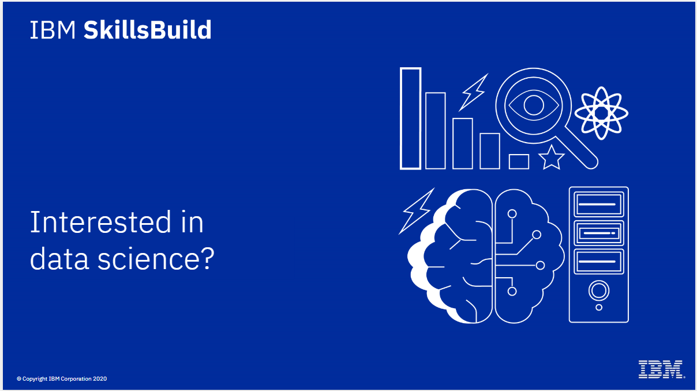

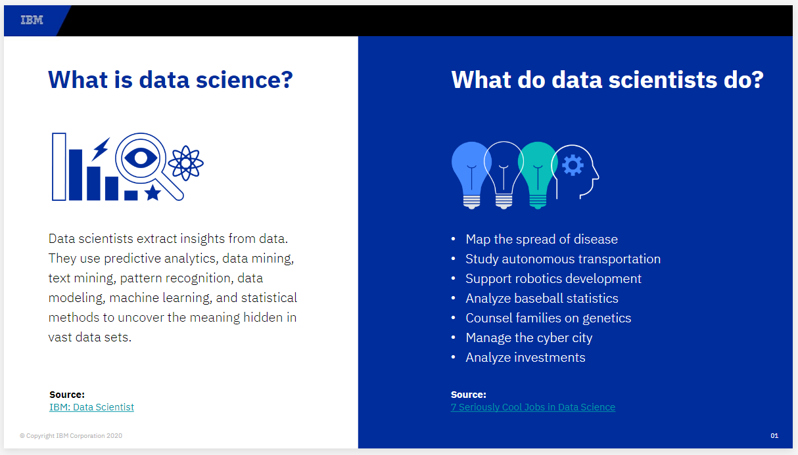

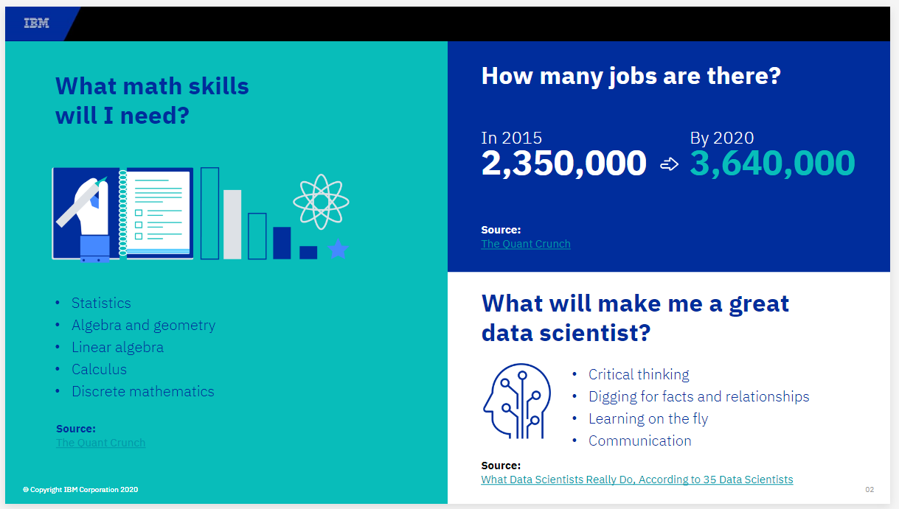

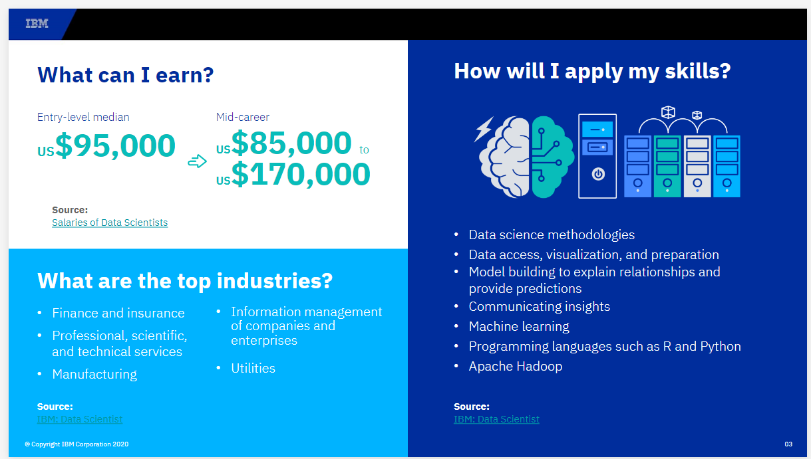

#### Técnicas para gestionar, compartir y poner datos a trabajar

##### Introduccion

*Hacer las cosas con ciencia de datos.*

Después de aprender sobre qué es la ciencia de datos en ¿Qué es la ciencia de datos? módulo, ahora es el momento de explorar
cómo se hace.

En este módulo, aprenderá sobre algunas de las herramientas y técnicas que utilizan los científicos de datos para encontrar
los conocimientos que contienen los datos. Esto incluye aprender cómo explorar datos en bases de datos relacionales, cómo
comunicar datos visualmente y cómo la ciencia de datos y el aprendizaje automático se unen para proyectar el futuro.

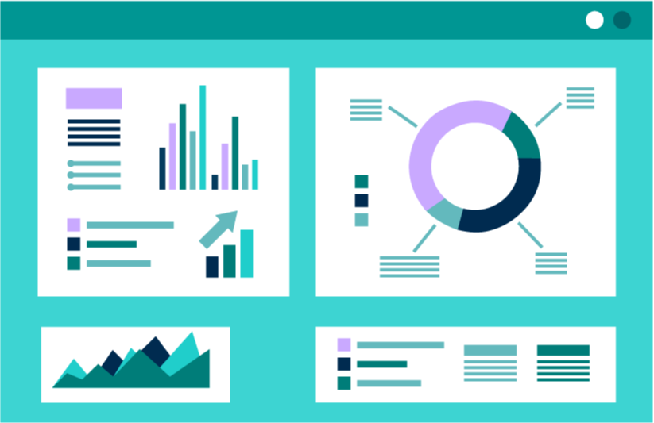

##### Ordenar datos para el analisis, Gestionando tus datos

**¿Que es una base de datos?**

Casi todos los científicos de datos dedicarán tiempo a trabajar en una base de datos , que es una colección organizada de
datos estructurados en un sistema informático. (Recuerde, los datos estructurados generalmente se organizan en formato de
tabla con filas y columnas, como el siguiente ejemplo).

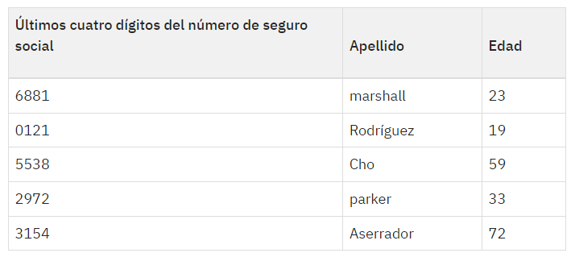

La mayoría de las bases de datos actuales están organizadas como bases de datos relacionales, que son colecciones de múltiples
conjuntos de datos o tablas que se vinculan entre sí.

Por ejemplo, una tabla puede enumerar nombres y direcciones, mientras que la otra puede enumerar propiedades y sus
propietarios. Si algunos de los propietarios también aparecen en la tabla de nombres y direcciones, las dos tablas se pueden
vincular, creando una base de datos relacional.

Los sistemas de gestión de bases de datos relacionales (RDMS) ayudan a los científicos de datos a correlacionar información
de todas las tablas dentro de la base de datos, cambiar datos relacionados o agregar y eliminar datos en la base de datos
sin romper su estructura.

**Utilice una base de datos para almacenar y ordenar datos.**

La mayoría de los sistemas de gestión de bases de datos utilizan algún tipo de lenguaje de consulta estructurado, o SQL,
para hacer preguntas o "consultar" la base de datos o modificar su contenido. SQL es increíblemente útil y es algo que
puedes aprender a través de un libro, un curso en línea o un club de informática. Vamos a ver cómo funciona.

Suponga que tiene un millón de filas de datos en una tabla de votantes registrados en su estado. (¡Muchas bases de datos son
así de grandes, o incluso más grandes!) La tabla contiene información sobre el lugar de votación, la afiliación partidista y
la edad de cada votante. Si solo quisiera obtener la información de todos los votantes menores de 21 años, podría escribir
una consulta en SQL que realice una búsqueda simple. Se vería así:

Sí, una simple búsqueda podría haber respondido a esta pregunta en particular. Sin embargo, si desea descubrir votantes que
viven en un área geográfica particular para poder estudiar la frecuencia con la que personas de diferentes edades de ese
grupo acuden a las urnas, su consulta abrumará una simple búsqueda. ¡Pero SQL puede hacer el trabajo!

Si bien SQL es el lenguaje subyacente que impulsa la mayor parte del trabajo realizado en bases de datos relacionales,
existen muchos RDBMS en los que puede realizar ese trabajo. A medida que se aventure en este campo, se encontrará con
nombres como estos:

        mysql
        acceso Microsoft
        PostgreSQL
        Oráculo
        DB2
        MongoDB

**Elija las herramientas adecuadas para gestionar los datos.**

¿Por dónde empiezas? ¡Existen docenas de herramientas y plataformas útiles de ciencia de datos! Aquí hay una lista de
algunas plataformas populares y de código abierto que puede utilizar para comenzar su propio viaje en ciencia de datos.

*R es un buen lugar para comenzar.*

R es un lenguaje de programación y un entorno de software gratuito que se utiliza a menudo para análisis estadístico y
ciencia de datos. Muchos aspirantes a científicos de datos comienzan con esta herramienta o con una de las interfaces R
populares, y hay cientos de paquetes útiles en R que ayudan con la visualización de datos como ggplot2.

Así es como se ve RStudio. Es una interfaz popular para trabajar en R.

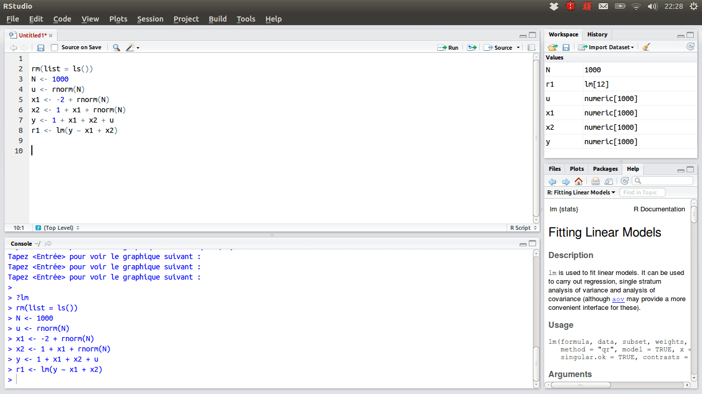

*Python funciona para propósitos generales.*

Python es un lenguaje de programación popular de propósito general que también se puede utilizar para la ciencia de datos.
Combínelo con una biblioteca como  la biblioteca pandas y con una interfaz útil, y Python puede ayudarlo a crear nuevos
conocimientos y visualizaciones de datos.

Así es como se ve Python en la interfaz de una computadora portátil.

*MATLAB ayuda a hacer números.*

MATLAB fue creado para centrarse en la computación numérica. Se utiliza a menudo en la educación superior.

*Apache Spark admite big data y aprendizaje automático.*

Apache Spark es un marco patentado de propósito general que puede resultar especialmente útil para conjuntos de datos
extremadamente grandes y el aprendizaje automático que los utiliza.

##### Visualizar datos para comunicarlos, Compartiendo tus resultados

**Visualiza tus datos.**

¿De qué sirven los datos si no se pueden comunicar de manera que la gente los entienda? Los científicos de datos utilizan
visualizaciones como gráficos o mapas para ayudar a las personas a comprender el significado de los datos. Si se usan
correctamente, estas herramientas pueden aportar claridad y simplicidad a cuestiones complicadas.

*Utilice gráficos para estadísticas.*

Los gráficos y cuadros son una excelente manera de arrojar luz sobre estadísticas confusas o información en tablas.

*Utilice mapas para las relaciones.*

Hay muchos tipos de gráficos y tablas, como el histograma que se muestra arriba, e incluye diagramas de dispersión,
diagramas de barras, diagramas de caja y muchos más.

Los mapas son una excelente manera de expresar datos que se pueden presentar como áreas en dos dimensiones. Funcionan bien
no sólo para la geografía, sino también para relaciones como la popularidad de la marca, las preferencias musicales o
incluso las redes eléctricas municipales.

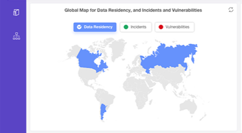

**Elija la herramienta adecuada para la visualización de datos.**

Puede crear visualizaciones de datos simples, como cuadros o gráficos, en la mayoría de los programas de hojas de cálculo.
Pero a medida que los datos se vuelven más complejos, recurrirá a otras herramientas. Algunos se venden como productos de
visualización independientes, mientras que otros son complementos de los sistemas de gestión de datos.

También encontrará excelentes libros, impresos y en línea, que lo ayudarán a hacer que sus visualizaciones sean más útiles.
Aquí tienes una pista: *¡mira el trabajo de Edward Tufte, un maestro de la visualización!*

*Tableau crea visualizaciones interactivas.*

Tableau puede ayudarle a crear visualizaciones interactivas sin escribir código. Muchas organizaciones en línea lo utilizan,
lo que lo convierte en una excelente herramienta para explorar.

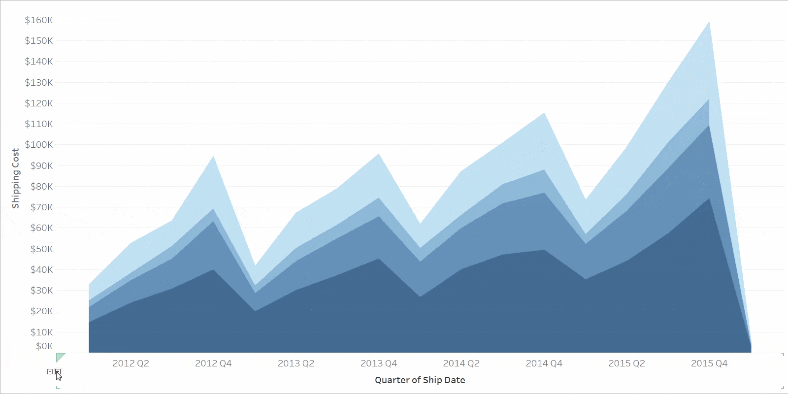

*ggplot2 ayuda con datos complejos.*

Una de las herramientas de espacio de trabajo de R más populares es ggplot2, que puede ayudar a visualizar datos que son
demasiado complejos para otros programas menos sólidos.

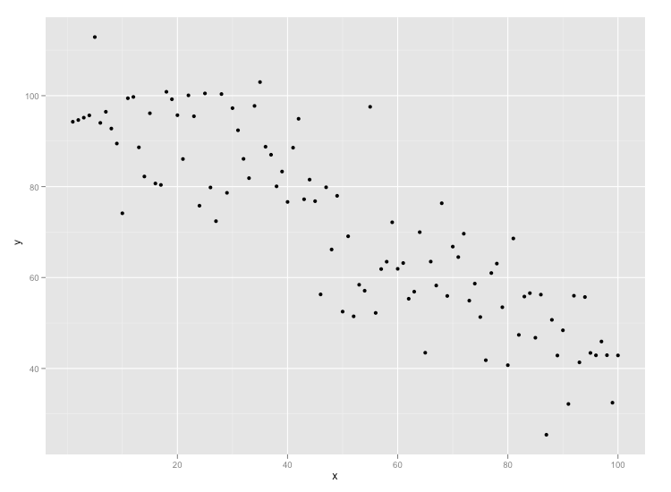

*Matplotlib funciona bien con Python.*

Matplotlib es una herramienta de visualización popular que funciona con el lenguaje de programación Python. Ayuda a los
programadores a crear cuadros, gráficos y mapas en muchos formatos diferentes.

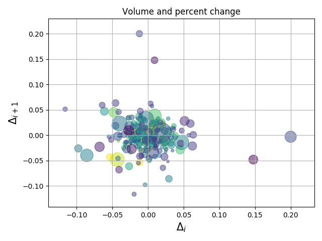

**¿Puede la visualización de datos describir tu propia pasión?**

En el ¿Qué es la ciencia de datos? En el módulo, exploraste la idea de algo que te apasiona y cómo se podrían aplicar los
datos a ese campo. Ahora, intenta entrar en la web y encontrar una visualización de datos que se aplique a tu pasión.

Podría ser un mapa de algún tipo, un cuadro, una gráfica o alguna otra imagen que ayude a expresar datos de una manera
diferente a una simple tabla. Después de buscar, tómate un tiempo para anotar qué tipo de visualización de datos has
encontrado.

Yo he encontrado cuantos jugadores he tenio un videojuego como last epoch desde el dia de s lanzamiento hasta la fecha, en
steam charts se muestra la grafica, es un tipo de grafico de linea que muestra cuantos jugadores ha tenido el juego en
simultaneo en marcos de tiempo predeterminados, horas, dias, semanas o años, mostrando los picos de mayor trafico y como
estos disminuyen de acurdo a ciertas situaciones en especifico, lanzamientos, actualizaciones o parches, caidas de
servidores, etc.

##### Utilice datos para impulsar el aprendizaje automatico

**¡Las máquinas pueden aprender!**

Durante muchos años, las computadoras sólo podían hacer cálculos matemáticos o ejecutar programas paso a paso de acuerdo con
reglas específicas. Pero hoy, la inteligencia artificial , o IA, ha cambiado las reglas del juego. Ahora, los sistemas no
vivos pueden, al igual que los sistemas vivos, sentir su entorno y tomar decisiones en pos de sus objetivos.

¡El aprendizaje automático  permite esta asombrosa habilidad! Los seres humanos están empezando a crear sistemas
informáticos que pueden aprender por sí solos, sin programas paso a paso ni reglas específicas. Los sistemas de aprendizaje
automático ya nos ayudan en la vida cotidiana. Considere, por ejemplo, lo que sucede cuando alguien de su familia toma una
fotografía de un cheque con su teléfono inteligente para realizar un depósito bancario. El aprendizaje automático ha
enseñado a los sistemas del banco cómo leer la letra de ese cheque y comprender su significado.

Aquí hay otro ejemplo. Hoy en día, cuando alguien con cáncer visita a un médico, ese médico puede mostrar en pantalla un
conjunto detallado de posibles tratamientos, cada uno de ellos basado en investigaciones actualizadas y completo con una
evaluación de la probabilidad de que funcione para ese paciente en particular. El médico toma la decisión, pero es la
máquina, que aprende cada vez más sobre el cáncer leyendo miles de informes de investigación tan pronto como se publican, la
que recomienda tratamientos probables.

**La ciencia de datos impulsa el aprendizaje automático.**

¿Se pregunta por qué lee sobre IA en un curso de ciencia de datos? Porque el aprendizaje automático requiere enormes
cantidades de datos y la capacidad de extraer significado de esos datos. ¡Eso es ciencia de datos a gran escala! Los
científicos de datos de hoy utilizan algoritmos y técnicas de aprendizaje automático para extraer información de los enormes
almacenes de datos del mundo.

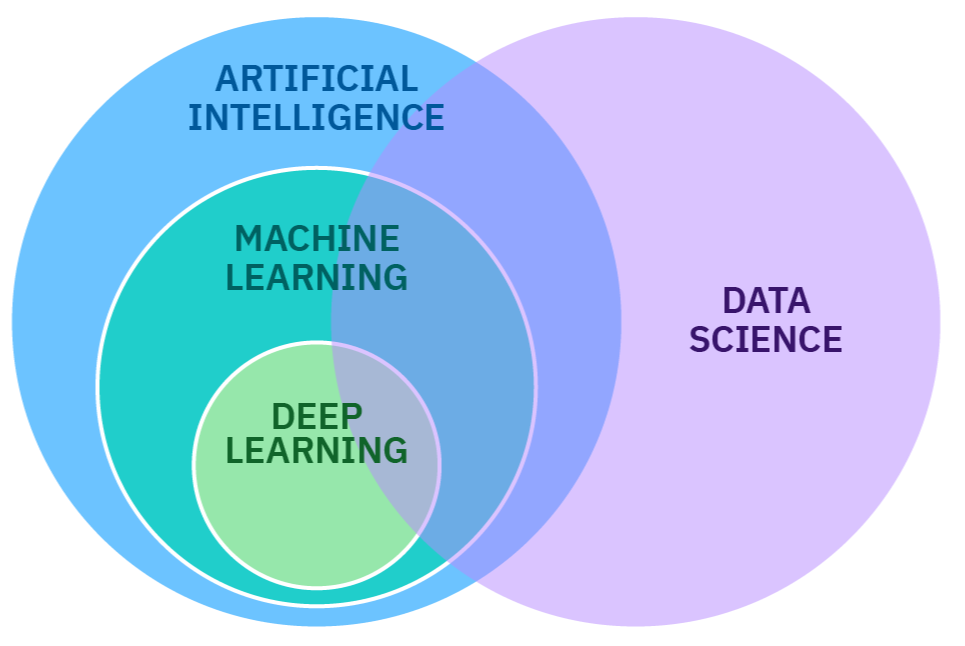

Aquí hay dos ejemplos de lo que podríamos aprender cuando el aprendizaje automático desglosa grandes cantidades de datos:

    La regresión explora cómo cambiará un conjunto de hechos o números cuando cambien otros factores o números relacionados,
    Por ejemplo, el aprendizaje automático puede estimar el precio de venta apropiado de una casa nueva en función de las
    ventas de otras casas similares en el área.

    La clasificación identifica grupos ocultos dentro de conjuntos de información aparentemente aleatorios. Por ejemplo, el
    aprendizaje automático puede mirar videos de miles de cámaras en las esquinas de las calles y rastrear los caminos seguidos
    por personas de un género, raza o apariencia en particular.

Aplicaciones como estas serían imposibles sin el poder de la ciencia de datos moderna.

#### Ciencia de datos en el mundo real

##### Trabajar con datos, Un día en la vida

**¿Cómo es trabajar con datos?**

Exploremos cómo son las carreras en ciencia de datos y cuáles son las oportunidades laborales. Analizaremos algunas
aplicaciones de la ciencia de datos en el mundo real. Luego profundizaremos en los trabajos de ciencia de datos y las formas
en que las empresas utilizan los datos.

Básicamente, el trabajo de un científico de datos es analizar grandes cantidades de información sin procesar para encontrar
patrones. Eso podría significar preprocesar datos, construir modelos para analizar esos datos o presentar información
utilizando técnicas de visualización de datos. La ciencia de datos siempre se trata de extraer información valiosa de los
datos.

##### Aplicando la ciencia de datos, ¿Para qué sirve?

**¿Cómo aplicamos la ciencia de datos?**

Desde cosas simples como la búsqueda de Google, los juegos y el desarrollo de productos hasta aplicaciones futuristas como
la realidad aumentada y la publicidad predictiva, la ciencia de datos ofrece beneficios a casi todas las industrias.

En el siguiente video, escuchará a varios jóvenes científicos de datos discutir posibles aplicaciones de la ciencia de datos
y algunas preocupaciones éticas sobre cómo se podrían aplicar sus hallazgos.

<https://youtu.be/LITpRGbrDkM>

##### ¿Cómo es ser científico de datos en IBM?, Empleos del mundo real

**Caminos apasionantes para los científicos de datos.**

IBM emplea científicos de datos en una variedad de campos, desde análisis de salud hasta energía y finanzas. El objetivo de
la ciencia de datos es ayudar a analizar tendencias para tomar mejores decisiones ante los desafíos comerciales. Estos
especialistas descubren patrones en los datos, los visualizan, los utilizan para resolver problemas y crean algoritmos para
convertir los datos en acción.

Escuche estas entrevistas con científicos de datos profesionales.

<https://youtu.be/CqcEW-jyDmo>

##### La ciencia de datos y tú

Algunas actividades para explorar más la ciencia de datos, Pruebe las siguientes actividades para ver cómo la ciencia de
datos podría aplicarse a su vida e intereses.

**¡Hacer una pregunta!**

Piense en una pregunta interesante que pueda responderse con datos. Aquí hay unos ejemplos:

¿Cuántos adolescentes viven en mi ciudad?
¿Cuál es el promedio de asistencias por partido de los bases en la NBA?
¿Qué canción pop se ha escuchado más en los últimos seis meses?
La pregunta puede ser cualquier cosa que quieras, siempre que te interese y puedas responderla si tienes los datos correctos.

**¡Reúne algunos datos!**

A veces lo primero es una pregunta. Otras veces, los científicos de datos encuentran un conjunto de datos que parece
interesante y luego lo exploran. Si no tienes la pregunta perfecta, ¡no te preocupes! Tu próximo paso podría ser encontrar
algunos datos interesantes sobre tu pasión. Eso podría generar varias preguntas interesantes.

Muchas industrias tienen datos disponibles públicamente en la web. Ya sea que te gusten los deportes, la música, la moda, el
arte, la salud, los juegos o cualquier otra cosa, comienza a buscar tablas que contengan datos estructurados que puedas
explorar.

**¡Pruebe una herramienta!**

¿Quizás una herramienta en particular despertó su interés? ¿Quizás le gustaría comenzar a crear gráficos usando R o siempre
quiso aprender más sobre Python? ¿O tal vez tiene su pregunta y sus datos y está listo para comenzar a utilizar técnicas
avanzadas para obtener información?

Continúe y experimente utilizando una de las herramientas de ciencia de datos disponibles públicamente de las que hablamos
en el módulo anterior. Importe una tabla a una herramienta, cree un gráfico o realice otro curso sobre un software.
¡Aprenderás (y harás) más mientras intentas trabajar en algo!

**¡Lee un blog!**

Los blogueros de IBM son un gran recurso para obtener una perspectiva más profunda de la ciencia de datos. Vuelva a
consultar de vez en cuando para ver temas sobre big data y análisis en acción en todo el mundo en el sitio Cloud Computing
News de IBM.

### Cloud computing

#### Que es cloud computing?

##### Introducción Cloud computing

**¡“La nube” no es una nube!**

Esto no es una nube. Así es un coche protegido de las tormentas por una compañía de seguros que conoce el tiempo hasta la
manzana cuadrada. Se trata de un diamante rastreado en una Blockchain protegido contra fraude, robo y tráfico. Se trata de
una transacción financiera segura contra ataques y amenazas que otros no pueden ver. Esto es un El historial médico del
paciente está seguro y al mismo tiempo está disponible para su médico al alcance de su mano. Esto es un asteroide
transmitido en vivo a millones de espectadores desde 220 millas sobre la Tierra. Se trata de IA entrenada por expertos en 20
industrias. Tu industria. Hola. Esta no es la nube que conoces. Esta es la nube de IBM. Creado para su negocio. Diseñado
para tus datos. Seguro hasta la médula. IBM Cloud es la nube para empresas. Su Nube.

Como aprendiste en este video, “la nube” no es una niebla de gotas de agua; es una vasta colección de datos. Escuelas,
empresas, centros de salud e incluso gobiernos están trasladando su información a la nube para almacenarla de forma segura y
hacerla accesible en línea.

**Pero aquí tienes una pregunta para que pienses...**

¿Sí o no? Si una organización coloca algo en la nube, ¿eso significa que los datos están fuera de sus instalaciones en
alguna parte?

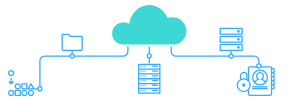

##### Entonces, ¿qué es la computación en la nube?, Cómo funciona

**¿Como funciona?**

Aquí está la respuesta corta: la computación en la nube almacena y procesa información a través de Internet en lugar de
hacerlo en el disco duro de una computadora.

¿Por qué hacer esto? Porque al compartir recursos informáticos en línea en lugar de depender del almacenamiento y las
computadoras locales, la nube puede lograr dos cosas:

Puede almacenar y procesar cantidades mucho mayores de información mucho más rápido. Puede ofrecer resultados a cualquier
dispositivo que pueda iniciar sesión en Internet, no sólo a un teléfono, tableta, computadora o conjunto de terminales
locales. Trabajas con servicios en la nube todos los días, cada vez que accedes a proveedores o servicios, como Netflix,
Dropbox, Microsoft Office Online, iTunes, la lista sigue y sigue….

Siempre que un servicio no requiera que usted esté físicamente cerca del hardware de almacenamiento, puede entregarle
información desde la nube. ¿Depositar un cheque a través de su teléfono? ¿Subir una foto para tus amigos? ¡Estás en la nube!

No cometer errores. Los datos todavía se almacenan en el hardware. Pero ese hardware podría haber abandonado el edificio.
Puede tomar dos formas:

Un servidor físico es un disco duro o banco de memoria dedicado a un grupo de usuarios o un tipo de datos.

Un servidor virtual es una porción única de ese pastel: una región controlada por software en un servidor físico cuyas
otras regiones son compartidas por otros usuarios. Debido a que compartir divide un servidor físico en varios servidores
virtuales, se llama virtualización .

**Los servicios en la nube toman tres formas:**

Todos conocemos los términos público, privado e híbrido , pero tienen significados especiales cuando se aplican a los
servicios en la nube.

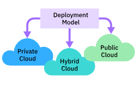

*Las nubes públicas comparten espacio de almacenamiento e informática.*

Las nubes públicas pertenecen y son operadas por empresas que ofrecen a sus clientes un acceso rápido a recursos
informáticos asequibles. Este es el modelo clásico de computación en la nube, en el que las pequeñas empresas y los
individuos como usted pueden acceder a una gran potencia informática a través de Internet. Es fácil de escalar cuando los
usuarios necesitan más energía o almacenamiento. Debido a que muchos usuarios trabajan dentro de un gran banco de
información pero sus datos deben mantenerse separados y seguros, este tipo de nube está organizada mediante lo que se llama
arquitectura multiinquilino.

*Las nubes privadas protegen la información de una sola entidad.*

Una nube privada se opera para una sola organización. Puede ser alojado y administrado por esa organización o por un
proveedor, y sus servidores pueden residir dentro o fuera de la propia organización. Por supuesto, esta privacidad también
significa que a medida que se expanden los datos de una nube privada, la organización tiene que instalar más y más
servidores privados. Las organizaciones prefieren una nube privada si necesitan un control estricto sobre dónde se guardan
sus datos, cómo se organizan y cómo se protegen. Las nubes privadas pueden ser muy seguras, ¡pero son caras!

*Las nubes híbridas dividen su almacenamiento en porciones privadas.*

¿Qué pasa si una empresa necesita el bajo costo y la escalabilidad de una nube pública, pero también necesita un entorno
seguro para el desarrollo de productos o datos confidenciales? Estas organizaciones terminan distribuyendo sus cargas de
trabajo entre centros de datos, nubes privadas y nubes públicas, creando así nubes híbridas.

Una nube híbrida mezcla recursos públicos y privados. Es un poco de esto y un poco de aquello, con algunos datos en una nube
pública y otros en una nube privada, proporcionados por múltiples proveedores que ofrecen diferentes niveles de uso de la
nube. La combinación de servidores físicos y virtuales de una nube híbrida permite a las organizaciones alquilar lo que
necesitan, según demanda, lo que les ayuda a controlar los costos y al mismo tiempo les brinda cierta flexibilidad.

IBM ha creído durante mucho tiempo que la mayoría de las empresas necesitan una nube híbrida. Hemos demostrado liderazgo al
ayudar a los clientes en su viaje a la nube, sin importar su punto de partida: nube privada, nube pública o varios tipos de
conexiones híbridas entre ellas.

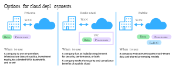

##### La nube “como servicio”, Tres modelos de servicio

**Computación en la nube: ¡a su servicio!**

Cualquier servicio tradicional se puede entregar a través de la nube. Este concepto se denomina cualquier cosa como servicio
o XaaS.

Comparemos los tres modelos de servicios más populares de computación en la nube: software como servicio ( SaaS ),
plataforma como servicio ( PaaS ) e infraestructura como servicio ( IaaS ). Aquí hay un diagrama que muestra los tipos de
herramientas y datos que encajan en cada modelo.

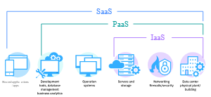

*Software como servicio (SaaS).*

Software como servicio (SaaS): alojar y entregar aplicaciones de software a través de Internet.Con SaaS, tanto el software
como los datos residen en línea. Los usuarios pueden iniciar sesión en un navegador desde casi cualquier tipo de dispositivo
en casi cualquier sistema operativo, ingresar lo que necesitan y aparece el resultado. Dado que su organización no necesita
software especial para utilizar SaaS, no tiene que comprar aplicaciones. En cambio, paga suscripciones anuales o por usuario
al servicio.

Puede visualizar SaaS como la cocina de otra persona. Te conectas a Internet y haces tu pedido. Ellos proporcionan la
receta, cocinan la comida y te la entregan.

Cuando escuche SaaS, piense en usos como el correo electrónico o las compras en línea.

*Plataforma como servicio (PaaS).*

Plataforma como servicio (PaaS): cree, ejecute y administre nuevas aplicaciones en la nubeCon PaaS, un proveedor proporciona
solo la plataforma, es decir, la infraestructura, los sistemas operativos, el almacenamiento y gran parte del código. La
organización del usuario gestiona los recursos y los datos de la aplicación. (Para obtener más información sobre la
infraestructura, consulte la siguiente sección).

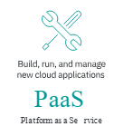

Puede visualizar PaaS como la cocina de otra persona. Pero tú proporcionas la comida cruda y la receta, y tú cocinas.

Cuando escuche PaaS, piense en contenedores, bases de datos, tiempo de ejecución e integración.

*Infraestructura como servicio (IaaS).*

Infraestructura como servicio (IaaS): alojar y entregar infraestructura de computación en la nube, Las empresas recurren a
IaaS cuando quieren crear sus propias aplicaciones desde cero o trasladar aplicaciones existentes desde un centro de datos a
la organización para reducir los costos de TI. Con IaaS, un proveedor proporciona la infraestructura y la arquitectura, como
hardware, software, servidores y almacenamiento, y también maneja costosos sistemas de soporte como respaldo, seguridad y
mantenimiento. Esto deja la arquitectura informática de la organización en la web para que los equipos en diferentes
ubicaciones puedan trabajar juntos, mientras se mantiene el desarrollo de aplicaciones dentro de la propia estructura en
línea de la empresa.

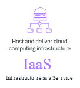

Puede pensar en IaaS como su propia cocina, donde usted proporciona la receta y cocina, pero alguien más mantiene sus
electrodomésticos y administra sus servicios públicos.

Cuando escuche IaaS, piense en recursos informáticos, de almacenamiento y de redes.

**¡Hay rumores en torno a la multinube!**

Multicloud es el uso de más de una nube pública. Permite a una empresa elegir diferentes servicios de diferentes nubes
públicas. Por ejemplo, la empresa podría combinar varios entornos IaaS públicos como IBM Cloud, Amazon Web Services y
Microsoft Azure, para que no estén encerrados en un solo proveedor de nube. ¡La multinube requiere una planificación
cuidadosa! Las organizaciones que lo consideren deben buscar un proveedor cuya arquitectura pueda escalar e integrarse con
los sistemas existentes de la empresa.

A qué se parece esto? Una empresa puede utilizar proveedores de nube separados para servicios de infraestructura (IaaS) y
software (SaaS), o incluso utilizar varios proveedores de infraestructura (IaaS). Esa empresa podría utilizar diferentes
proveedores de infraestructura para diferentes cargas de trabajo, equilibrar una única carga de trabajo entre varios
proveedores o utilizar una única carga de trabajo en un proveedor respaldada por otro.

**Nubes y on-promise, ¿cuál es la diferencia?**

A menudo la gente habla de nube pública y privada y las confunde con instalaciones. Por ejemplo, podrían pensar que la nube
pública está fuera de las instalaciones (verdadero), mientras que la nube privada siempre está dentro de las instalaciones
(falso).

Fuera de las instalaciones es una solución que se ejecuta en hardware en una ubicación diferente a la de los usuarios
finales. Esto se debe a que la mayoría de los proveedores de nube administran sus propios centros de datos fuera de las
instalaciones de las organizaciones cuyos datos almacenan. Los administradores de sistemas de sus clientes tienen el mismo
acceso a los datos que tendrían localmente.

On-premise es una solución instalada y alojada internamente, generalmente respaldada por un tercero. A menudo, la nube
privada local, también conocida como “nube interna”, está alojada dentro del propio centro de datos de una organización.
Puede ser más fácil de proteger y mantener, pero de tamaño más limitado y más difícil de ampliar a medida que crece la
organización.

Algunos proveedores de nube ofrecen una solución híbrida . Esto significa que permiten a las empresas combinar las
instalaciones en el centro de datos de la empresa con las instalaciones en el centro de datos del proveedor. Esto puede
resultar útil si el negocio de una empresa llega en ráfagas. La empresa puede depender de su propio centro de datos la mayor
parte del tiempo, pero expandirse al centro de datos del proveedor cuando la carga es alta.

Esto es lo que confunde a la gente: una organización puede tener una nube privada ya sea dentro o fuera de las instalaciones.

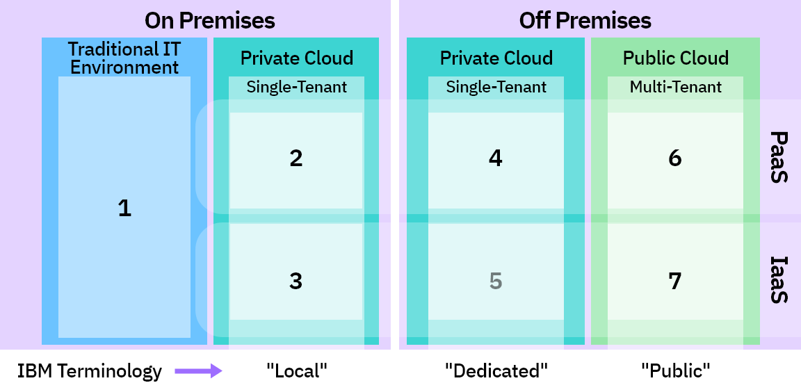

Tómese un momento para analizar el siguiente gráfico y ver cómo una empresa podría tener capacidades tanto PaaS como IaaS:

Una nube privada local (2 y 3 en el gráfico)
Una nube privada fuera de las instalaciones (4 y 5)
Una nube pública (6 y 7)

Los vendedores de IBM se refieren a estos entornos como locales, dedicados y públicos . Tómate un momento para reflexionar
sobre estas combinaciones ahora.

##### Terminología de computación en la nube, conocer la jerga

La terminología que rodea a la computación en la nube puede ser abrumadora y hay mucho que seguir al día. Estos son algunos
de los principales términos y acrónimos que cubren conceptos clave de computación en la nube.

*Nube:*

En la computación en la nube, “nube” se utiliza como metáfora de Internet, por lo que la frase computación en la nube
significa un tipo de computación basada en Internet.

*Servicios en la nube:*

Los servicios en la nube son aplicaciones, servicios o recursos puestos a disposición de los usuarios a pedido a través de
Internet, tales como:

Infraestructura como servicio (IaaS)
Plataforma como servicio (PaaS)
Software como servicio (SaaS)
Almacenamiento de datos

*Clústeres:*

Un clúster de computadoras es una colección de computadoras o servidores independientes interconectados que pueden trabajar
juntos como un recurso informático único e integrado.

*Contenedores:*

Un contenedor es un "envoltorio" que permite que el software viaje entre entornos operativos. Los contenedores crean una
instancia virtual única de un sistema operativo (SO) que separa una aplicación de otras en el mismo entorno. Los
contenedores pueden ejecutar instancias separadas de una aplicación dentro de un único sistema operativo compartido.

*Nube híbrida:*

Una nube híbrida es una combinación de TI tradicional y nubes públicas o privadas (o ambas) que permanecen separadas, pero
están unidas por tecnología que hace que los datos o la aplicación sean portátiles.

*Infraestructura como servicio (IaaS):*

IaaS ofrece infraestructura informática de forma subcontratada para respaldar las operaciones de una empresa. Incluye
servidores, red, sistemas operativos y almacenamiento, a través de tecnología de virtualización que no requiere que la
empresa la mantenga o administre físicamente. Sus servidores en la nube suelen incluir un panel o una interfaz de
programación de aplicaciones (API) que brinda a la empresa el control de toda la infraestructura.

Las nuevas empresas y las pequeñas empresas pueden preferir IaaS para evitar gastar tiempo y dinero comprando y creando
hardware y software, como servidores, almacenamiento o recursos de red.

Cuando escuche IaaS, piense en recursos informáticos, de almacenamiento y de redes.

*Kubernetes:*

Kubernetes es una plataforma de código abierto para gestionar cargas de trabajo y servicios en contenedores.

*Multinube:*

La multinube es el uso de más de una nube pública, una estrategia que permite a las empresas elegir servicios específicos de
una combinación de nubes públicas IaaS como IBM Cloud, Amazon Web Services y Microsoft Azure. Esto permite a las empresas
evitar depender de un solo proveedor de nube.

*Dentro de las instalaciones versus fuera de las instalaciones:*

On-premise se refiere a una solución instalada y alojada internamente. La nube privada está alojada en el centro de datos
de la propia empresa.

Una solución alojada en hardware dedicado que se encuentra en una ubicación física diferente se denomina externa.

*Plataforma como servicio (PaaS):*

PaaS proporciona componentes en la nube para programas de software. PaaS ofrece un marco para desarrolladores que pueden
utilizar para crear aplicaciones personalizadas. La plataforma suele incluir un sistema operativo, un entorno de ejecución
de lenguaje de programación, una base de datos y un servidor web.

Cuando escuche PaaS, piense en herramientas de desarrollo, gestión de bases de datos y análisis de negocios.

*Nube privada:*

Una nube privada es una infraestructura de nube local o externa operada únicamente para una organización. Puede ser
gestionado por esa organización o por un tercero.

*Nube pública:*

Una nube pública está disponible para el público en general o para un gran grupo industrial, y es propiedad y está
administrada por una organización que vende servicios en la nube.

*Software como servicio (SaaS):*

SaaS se refiere a un modelo de implementación de software en el que el software en línea se proporciona como un servicio
a los clientes.

Cuando escuche SaaS, piense en aplicaciones de suscripción alojadas o correo electrónico web, aplicaciones de Google o
Dropbox.

*Virtualización:*

La virtualización es la creación de una versión virtual (en lugar de real) de algo como un servidor, un escritorio, un
dispositivo de almacenamiento, un sistema operativo o recursos de red.

*Máquina virtual:*

Una máquina virtual (VM) es un programa de software o sistema operativo que se comporta como una computadora independiente
que puede ejecutar aplicaciones y programas.

*Carga de trabajo:*

Una carga de trabajo es una capacidad discreta o una cantidad de trabajo que se ejecutará en la nube, como por ejemplo ofrecer
un sitio web.

##### Carreras en computación en la nube, Infografía

A estas alturas ya comprende que las tecnologías y servicios de computación en la nube están en todas partes. Quizás se
pregunte qué industrias se centran más en la computación en la nube, qué habilidades técnicas podrían estar en demanda o
cuáles son los trabajos interesantes en este campo. Las respuestas a estas preguntas, además de algunos datos más, se
incluyen en la siguiente infografía.

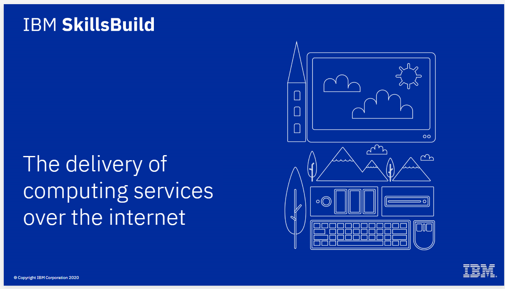

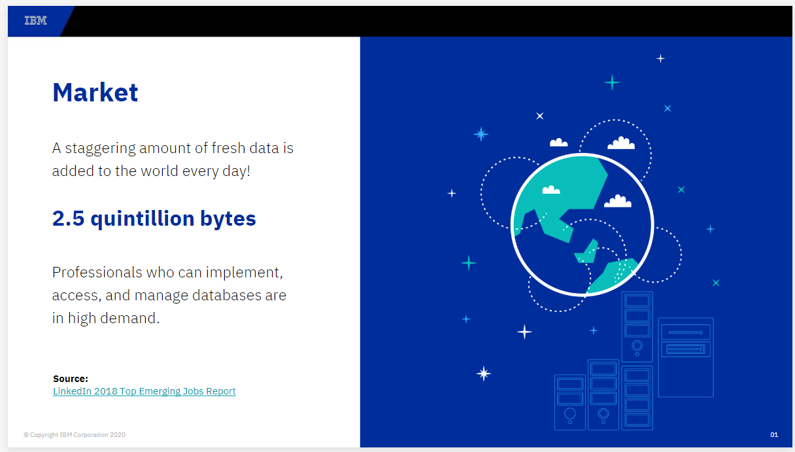

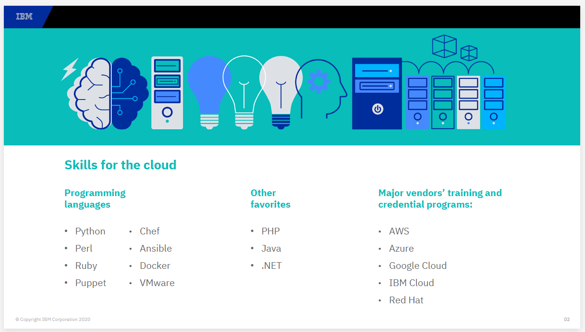

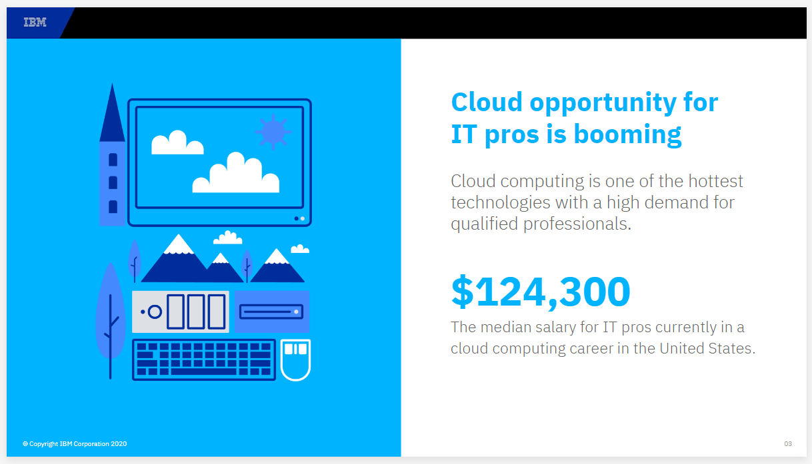

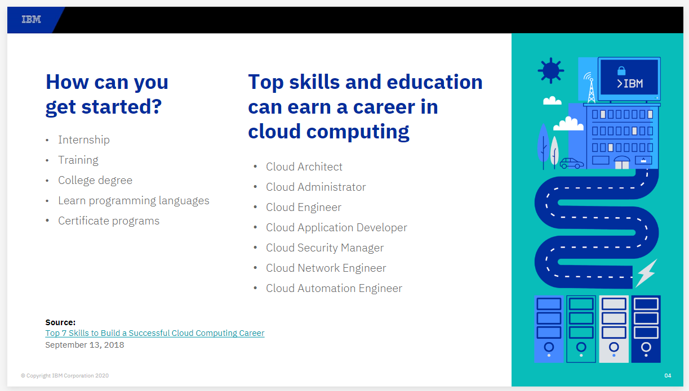

#### Como se utiliza el cloud computing?

##### Introducción, nube en el trabajo

Este curso le ayudará a comprender cómo se utiliza la computación en la nube todos los días. Revisará los beneficios de la
nube y sus aplicaciones en el mundo real, y conocerá formas en las que podría comenzar su propia carrera en la computación
en la nube. Pero primero, una pregunta.

Imagine que tiene un trabajo desarrollando software de juegos en línea para una empresa como Rockstar o Valve. ¿Qué modelo
de servicio en la nube crees que usarías?

        Saas
        PaaS
        IaaS

Tenga en cuenta su mejor estimación a medida que continúa. Encontrarás la respuesta en un próximo tema.

Ahora vea un breve vídeo sobre cómo IBM Cloud ayuda a las empresas a responder de forma más eficaz a sus clientes.

Todo el mundo sabe que los negocios actuales se basan en datos. La cuestión es que la mayoría de las empresas no están
obteniendo la al máximo. IBM Cloud está diseñado exclusivamente para todo tipo de datos, como datos meteorológicos. empresa
para 2.200 millones de ubicaciones, o miles de millones de puntos de datos relacionados con la salud, incluso el sentimiento
social en tiempo real. tiempo de cientos de millones de personas. Todo está en la nube de IBM. Si combinas eso con los datos
de tu el negocio ya lo ha hecho, entonces las cosas se ponen interesantes. Ahora mismo estamos trabajando con un minorista
para combinar datos sociales y de inventario para ayudar a predecir la demanda. Podemos ayudar a una cadena hotelera a
igualar el clima y la información local. datos de eventos, para que puedan ajustar los precios de las habitaciones minuto a
minuto. Y otra empresa con la que trabajamos. puede aplicar análisis a los datos de los sensores para ahorrar millones en
costos de energía. Hoy en día, todas las empresas funcionan con datos. Es exactamente por eso que construimos la nube de
IBM.

##### La nube ayuda a las empresas a prosperar, Tres valores principales

Los beneficios de la computación en la nube varían según cómo la utilice cada empresa. Toda empresa quiere controlar los
costes. Más allá de eso, diferentes empresas tienen diferentes requisitos. Podemos resumir los beneficios de la nube en tres
frases: flexibilidad, eficiencia y valor estratégico:

Flexibilidad : los usuarios pueden escalar los servicios en la nube para adaptarlos a sus necesidades, personalizar
aplicaciones y acceder a Internet para trabajar en cualquier momento y en cualquier lugar.

Eficiencia : los usuarios empresariales pueden llevar aplicaciones al mercado rápidamente, sin preocuparse por el alto
costo de la infraestructura o el mantenimiento.

Valor estratégico : los servicios en la nube ayudan a las empresas a competir con la tecnología más actualizada.

**La nube mejora la innovación.**

¡La innovación mantiene a las empresas a la vanguardia de la tecnología! Piense en las innovaciones que han transformado su
propia vida: teléfonos que ponen computadoras en su bolsillo, automóviles que lo guían por caminos desconocidos,
inteligencia artificial (IA) que ayuda a los médicos a elegir mejores tratamientos para su familia.

Las innovaciones técnicas dependen de la nube, lo que la convierte en la puerta de entrada a la IA, la cadena de bloques, el
Internet de las cosas (IoT) e incluso la computación cuántica. Para mantenerse a la vanguardia, las empresas necesitan la
nube y su gestión de la información rápida y fácil de actualizar.

##### La nube nos ayuda a todos, Mini-cuestionario

Quizás recuerdes que la nube se presenta en tres formas:

SaaS (software como servicio)
PaaS (plataforma como servicio)
IaaS (infraestructura como servicio)
Los tres modelos de servicio impactan nuestras vidas.

**Software como servicio (SaaS).**

Software como servicio (SaaS): alojar y entregar aplicaciones de software a través de Internet. Recuerde, SaaS es un modelo
de distribución de software en el que un proveedor externo aloja aplicaciones y las pone a disposición de los clientes a
través de Internet.

En el modelo SaaS, la computación en la nube permite a los consumidores y empresas utilizar aplicaciones sin instalarlas
localmente y acceder a archivos personales a través de Internet desde cualquier computadora. Esto hace que la informática
sea más eficiente porque centraliza el almacenamiento, la memoria, el procesamiento y el ancho de banda.

*¿Cómo cambia esto tu vida?*

Consulta el correo electrónico en Gmail, carga imágenes en DropBox, compra música en iTunes, almacena archivos en Google
Drive, crea con software como Office 365 o Photoshop, asiste a videoconferencias con Webex o organiza viajes con Expedia.
Estos servicios conectan a los consumidores (¡ese es usted!) con las empresas.

**Plataforma como servicio (PaaS).**

Plataforma como servicio (PaaS): cree, ejecute y administre nuevas aplicaciones en la nube. Un proveedor de PaaS proporciona
herramientas de hardware y software a través de Internet, y la gente utiliza estas herramientas para desarrollar
aplicaciones. PaaS es más importante para los desarrolladores que crean aplicaciones de software. PaaS les libera de tener
que instalar hardware y software internos para desarrollar o ejecutar sus nuevas aplicaciones.

*PaaS tiene menos impacto en usted personalmente, en el sentido de que la usará con menos frecuencia.*

Pero empresas como IBM, Google, Amazon y Microsoft tienen ofertas de PaaS que los desarrolladores pueden utilizar para
desarrollar e implementar rápidamente aplicaciones en la nube. A los desarrolladores les encanta esto no sólo porque
facilita mucho el acceso y las pruebas, sino porque no tienen que invertir ni aprender a gestionar la infraestructura que
ejecuta esas aplicaciones. ¿Y qué cosas desarrollan estas empresas, desde Internet de las cosas hasta compras, electrónica y
software creativo? Los estás experimentando ahora mismo mientras lees este texto.

**Infraestructura como servicio (IaaS).**

Infraestructura como servicio (IaaS): alojar y entregar infraestructura de computación en la nube IaaS ofrece servicios como
almacenamiento de pago por uso, redes, servidores y virtualización. IaaS ofrece a los usuarios alternativas basadas en la
nube a la infraestructura local, para que las empresas puedan evitar invertir en costosos recursos locales.

¡Esto es particularmente útil para pequeñas y medianas empresas! Les permite pagar por un plan de hosting que satisfaga sus
propias necesidades, sin el alto costo de mantener sus propios servidores físicos.

¿Cómo te afecta esto personalmente? Intente visitar un negocio del vecindario donde conozca a un empleado de tiempo parcial
o completo. Pregúnteles qué parte de su operación implica una conexión a Internet. Luego pregúntese cómo ese negocio afecta
su vida o la de las personas que conoce.

##### La computación en la nube y tú, Explora más

La computación en la nube es una tecnología de moda con una gran demanda de profesionales calificados. ¡Esto podría
incluirte a ti! Para conseguir un trabajo en este campo, necesitas habilidades específicas. Veamos qué puede ayudarle a
prepararse para una carrera en informática en la nube.

Ahora mismo, solo o en un club de informática, puedes empezar a aprender un lenguaje de programación importante para
trabajar en la nube. Python, Perl y Ruby son de código abierto y cada año se vuelven más populares. Otros "viejos favoritos"
incluyen PHP, Java y .NET.

¿Ya tienes experiencia en programación? Los principales proveedores como Amazon y Microsoft ejecutan programas de
capacitación y certificación que pueden hacerlo atractivo para las empresas de tecnología. Considere obtener credenciales en
temas como IBM Cloud Certification, AWS Certification, Azure Certification y Google Cloud Certified.

A medida que su carrera cobre impulso, desarrollará sus certificaciones con experiencia práctica en algunas de las
plataformas en la nube más comunes:

    Servicios web de Amazon
    nube de ibm
    Plataforma en la nube de Google
    MicrosoftAzure

Puede comenzar ahora, incluso si eso solo significa buscar en línea más información sobre la tecnología en la nube. Luego
contactas a un profesor o alguien que trabaja en una empresa tecnológica, luego te unes a un club de informática... y a
partir de ahí, ¡el cielo es el límite para tu desarrollo!

**¿Listo para aprender más?**

Comience aprendiendo un lenguaje de programación o una tecnología específica en la que pueda obtener una certificación. Los
cursos universitarios y en línea son una excelente manera de mejorar sus habilidades. Piense en realizar una pasantía: una
excelente manera de ver si esta tecnología es adecuada para usted.

*Mire hacia el futuro hacia una carrera profesional en la nube.*

Los roles tecnológicos evolucionan a medida que evolucionan la tecnología y las aplicaciones. Pero una carrera en la nube en
IBM puede llevarlo a muchas carreras profesionales y especialidades técnicas interesantes. ¡Imagínese trabajar en
inteligencia artificial (IA), Internet de las cosas (IoT) o blockchain! Todas estas tecnologías utilizan el poder de la
nube. Considere algunas de estas funciones de la computación en la nube:

Un arquitecto de la nube supervisa el enfoque de computación en la nube de una empresa.

Un ingeniero de la nube es un rol multidisciplinario responsable de administrar las capacidades de la nube de una empresa.
El puesto suele implicar la implementación y gestión de los modelos de prestación de servicios en la nube (IaaS, PaaS y
SaaS).

Un desarrollador o ingeniero de software en la nube es responsable de diseñar y desarrollar aplicaciones, productos y
servicios seguros en la nube.

**¿Qué más puedes hacer para desarrollar tus habilidades de computación en la nube?**

Los blogueros de IBM son un gran recurso para obtener una perspectiva más profunda sobre la computación en la nube. Vuelva a
consultar de vez en cuando para ver la computación en la nube en acción en todo el mundo.

Revise el sitio Thoughts on Cloud para obtener más información sobre la computación en la nube y ejemplos de servicios de
IBM Cloud en funcionamiento.

<https://www.ibm.com/blogs/cloud-computing/>

**¡Más artículos para que los revises hoy!**

Profundice en la tecnología de computación en la nube y conozca posibles carreras en este campo con estos artículos de IBM
Thoughts on Cloud:

<https://www.ibm.com/blogs/cloud-computing/2019/09/02/cloud-social-change/?ite=69293&ito=2166&itq=dc9728f8-e287-4025-ae2e-9ea4eecf15bd&itx%5Bidio%5D=48377951>

<https://www.ibm.com/blogs/cloud-computing/2014/02/06/top-7-most-common-uses-of-cloud-computing/>

### Inteligencia Artificial (IA)

#### Que es la inteligencia artifical

##### Introducción

La inteligencia artificial, o IA , es la ciencia que hace que las máquinas sean inteligentes. Gracias a los recientes
avances en informática, las máquinas están aprendiendo a resolver problemas, algo que solíamos pensar que sólo los humanos
podían hacer.

Antes de comenzar, intente responder esta pregunta alucinante. ¡Piénsalo un poco! Descubrirá la respuesta correcta a medida
que avance en el curso.

¿Crees que las máquinas, como los humanos y los perros, pueden aprender cuando reciben una recompensa por hacer algo bien?

A. Sí B. No, eso es una tontería.

Tenga en cuenta su respuesta a medida que ingresamos en nuestra exploración de la inteligencia artificial.

**IA EXPLICADA EN 101 SEGUNDOS.**

Comencemos viendo este vídeo de Qualcomm, que muestra el potencial de la IA para hacernos la vida más fácil y emocionante.

<https://youtu.be/zjeBGkS4LAA>

##### ¿Puede realmente pensar una computadora?, ¿Cómo podemos saberlo?

**La máquina pensante no es una idea nueva.**

Durante siglos, la gente ha imaginado máquinas que piensan y se comportan como personas. Se decía que el dios griego Hefesto
construyó máquinas de oro para trabajar para él. En la década de 1920, el escritor checo Karel Capek imaginó personas de
metal que pensaban como humanos y acuñó la palabra “robot” para describirlos. En 1950, el matemático inglés Alan Turing se
preguntó si una máquina podría pensar alguna vez y preguntó: “¿Cómo podemos saber si una máquina está pensando?” Para
responder a la pregunta, razonó que “pensar” es difícil de definir, por lo que podría ser mejor considerar el pensamiento
como un comportamiento. Propuso una prueba: si una máquina puede mantener una conversación con un humano, y el humano no
puede decir que es una máquina, entonces podemos decir con seguridad que la máquina está "pensando".

Poco después, en 1956, el campo moderno de la inteligencia artificial despegó en el Dartmouth College cuando un grupo de
científicos predijo que en la próxima generación se podría construir una máquina tan inteligente como un ser humano. Estaban
desviados por algunas décadas, pero su visión ha guiado el campo moderno de la IA, y la prueba de Turing sigue siendo el
estándar de oro para identificar el pensamiento automático.

**Podemos probar el pensamiento automático con un “juego de imitación”.**

En la prueba de Turing, un interrogador se comunica a través de un teclado con una máquina o con una persona, pero no sabe
cuál está al otro lado de la línea.

Aquí hay una demostración rápida de cómo podría funcionar esto en este video de TED-Ed.

<https://youtu.be/3wLqsRLvV-c>

**¿Qué mide directamente la prueba de Turing?**

A. Qué tan bien una computadora puede imitar la conversación humana
B. El nivel de conciencia en un programa de computadora
C. La memoria y el poder de procesamiento de un programa de computadora

Si adivinaste A , ¡tienes razón!

La medida original era poder sustituir a uno de los jugadores sin cambiar sustancialmente los resultados. En otras palabras,
una computadora se consideraría inteligente si su conversación no pudiera distinguirse fácilmente de la de un humano.

##### Las computadoras ayudan a los humanos, La IA se pone a trabajar

**Inteligencia humana versus inteligencia artificial.**

Para tener una conversación sobre inteligencia artificial (IA), necesitamos una definición práctica de inteligencia humana
(HI). Consideremos que la inteligencia humana es la capacidad de razonar, resolver problemas y aprender. Estas actividades
implican una interacción compleja entre funciones cognitivas como la percepción, la memoria, el lenguaje y la planificación.

La gente hace estas cosas de forma natural porque la inteligencia humana nos permite aprender de experiencias pasadas,
adaptarnos a nuevas situaciones y manejar ideas abstractas. Los seres humanos pueden utilizar el conocimiento aprendido para
adaptarse, dar forma y cambiar su entorno.

**Tipos de IA.**

La IA puede procesar datos y hacer ciertos tipos de predicciones de manera más rápida y precisa que los humanos. Pero no es
mágico ni todopoderoso.

Veamos los diferentes niveles de IA y lo que pueden lograr.

*IA débil.*

Muchas empresas utilizan una IA débil para automatizar tareas y obtener resultados rápidamente y a menores costos. La IA
débil supera a los humanos en tareas estrechamente definidas. Piense en un chatbot que responde preguntas sobre servicio al
cliente, reconocimiento facial en Facebook, recomendaciones de compra en Amazon o aplicaciones que pueden convertir voz en
texto. Alexa, Google Assistant y Siri demuestran una IA débil.

*Inteligencia aumentada.*

La inteligencia aumentada complementa la inteligencia humana y ayuda a los humanos a tomar mejores decisiones. No reemplaza
a los humanos. En cambio, aumenta su experiencia y mejora su productividad. IBM Watson for Oncology, por ejemplo, ayuda a
los profesionales de la salud a identificar información clave en los registros médicos de un paciente con cáncer y
recomienda varios tratamientos posibles junto con estimaciones de cómo podría funcionar cada uno. Sus recomendaciones son
excelentes, basadas en investigaciones constantemente actualizadas en la ciencia del cáncer. Pero no elige el tratamiento
del paciente. Eso depende del profesional de la salud. En otras palabras, la inteligencia aumentada ayuda a los humanos a
ser más rápidos e inteligentes en las tareas que realizan.

*IA general.*

La IA general aún no existe. Pero cuando lo haga, será una forma de “emulación de todo el cerebro”, en la que una máquina
podrá pensar y tomar decisiones sobre muchos temas diferentes. Manejará las computadoras que se ven en videos de ciencia
ficción, hablará con humanos sobre muchos temas, mientras opera ciudades o naves espaciales enteras. Hoy en día, la IA
general es un objetivo más que una tecnología práctica. Se necesitarán décadas de investigación adicional y computadoras más
potentes para lograrlo.

**¿Quizás también hayas oído hablar del aprendizaje automático y del aprendizaje profundo?**

A continuación, exploremos términos importantes que describen formas en que la IA puede resolver problemas complejos. El
siguiente gráfico proporciona un buen resumen de la relación entre la IA, el aprendizaje automático y el aprendizaje
profundo.

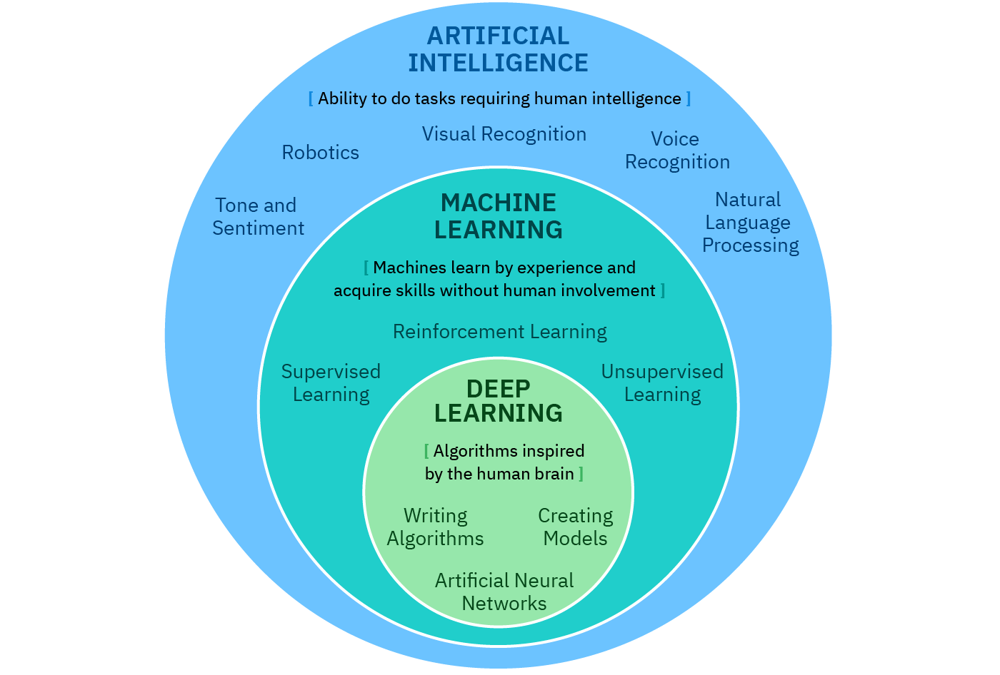

*Inteligencia artificial.*

La inteligencia artificial describe máquinas que ejercitan capacidades normalmente asociadas con la inteligencia humana. La
investigación actual en IA se centra en el aprendizaje, el razonamiento, la resolución de problemas, la percepción y la
comprensión del lenguaje humano. En el próximo curso aprenderá más sobre cómo los avances en IA nos ayudarán a ser todos más
inteligentes, comunicarnos, resolver problemas de la sociedad y cambiar la forma en que trabajamos.

*Aprendizaje automático.*

El aprendizaje automático , o ML, utiliza algoritmos para aprender de los datos. Dada una entrada de datos, ML puede
realizar análisis estadísticos para determinar una salida. Como ocurre con cualquier tipo de informática, cuantos más datos
se le proporcionen a la máquina (suponiendo que estos datos sean válidos), más preciso será su resultado. ¡ML utiliza
capacidades similares a las humanas, como análisis, autoformación, observación y experiencia, para aprender sin estar
programado explícitamente!

El aprendizaje automático se presenta en tres versiones: aprendizaje supervisado, aprendizaje no supervisado y aprendizaje
por refuerzo. ML se basa en estos tres tipos de algoritmos. La aplicación de cualquiera de estos algoritmos depende de la
relación con los datos disponibles que está procesando, el resultado que necesita de su modelo o tal vez incluso la
posibilidad de retroalimentar datos para mejorar el algoritmo. Si suena complicado, lo es.

Un aspecto sorprendente del aprendizaje automático es su capacidad de modificarse cuando se expone a más datos. ¡Es dinámico
y no requiere intervención humana para realizar cambios! Entonces, a medida que se expone a más datos, continúa aprendiendo
y mejorando sus resultados.

El aprendizaje automático es lo que impulsó al banco a ponerse en contacto con usted para saber si alguien podría utilizar
información robada de su tarjeta de crédito. Pero no es perfecto. El aprendizaje automático también es lo que desestimó tus
recomendaciones de Netflix después de que alguien de tu familia vio una comedia extraña en tu cuenta.

*Aprendizaje profundo.*

El aprendizaje profundo , o DL, es una subcategoría del aprendizaje automático que se centra en modelos estadísticos cuando
resuelve problemas. Utiliza una red neuronal artificial, hecha de algoritmos inspirados en el cerebro humano, mientras
resuelve problemas complejos realizando tareas una y otra vez miles de veces, modificándolas un poco cada vez para mejorar
el resultado. DL requiere big data y una enorme potencia informática, pero tiene un enorme potencial a medida que avanzamos
hacia el objetivo de la IA general.

Imagine la complejidad de las decisiones para realizar tareas de clasificación directamente a partir de imágenes, texto o
sonido con una precisión que podría superar el desempeño humano. ¿Qué tal los coches sin conductor?

El aprendizaje profundo es una tecnología clave detrás de los automóviles sin conductor, que permite a la computadora
reconocer una señal de alto o distinguir a un peatón de una farola.

##### Otras tecnologías ayudan a la IA, Es mutuo

La IA creará nuevas oportunidades para la sociedad, las empresas y los consumidores. Pero para que la IA se adopte más
ampliamente, otras tecnologías habilitadoras deben madurar junto con ella.

La nube, por ejemplo, ya está ayudando a las empresas a acceder y compartir potencia informática que normalmente no podrían
permitirse. Esta tecnología compartida, a su vez, permitirá a esas empresas operar nuevos algoritmos de entrenamiento y
gestión de datos requeridos por la IA.

Otras tecnologías emergentes también serán vitales para el crecimiento de la IA. El reconocimiento visual, el procesamiento
del lenguaje natural, el análisis predictivo e incluso el Internet de las cosas (IoT) potenciarán la IA, lo que conducirá a
nuevas aplicaciones en dispositivos médicos, seguridad, servicio al cliente y más.

A medida que avance su carrera en informática, verá surgir tecnologías completamente nuevas que obtienen su fuerza de la
inteligencia artificial.

##### Carreras en inteligencia artificial, Infografía

Ahora ya comprende que la tecnología de inteligencia artificial está en todas partes. Quizás se pregunte qué industrias
necesitarán expertos en IA, qué habilidades técnicas podrían estar en demanda o cuáles son los trabajos interesantes en este
campo. Las respuestas a estas preguntas, además de algunos datos más, se incluyen en la siguiente infografía y artículo.

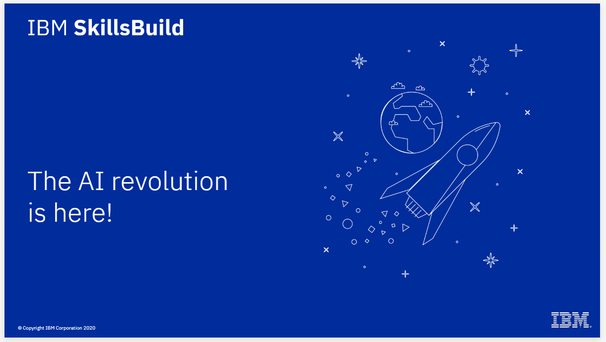

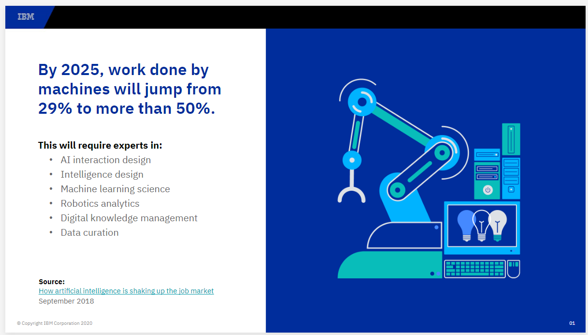

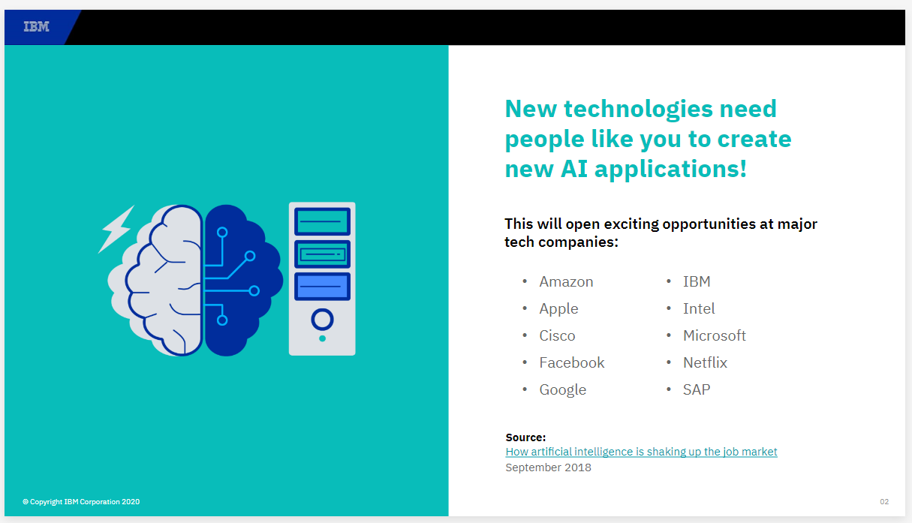

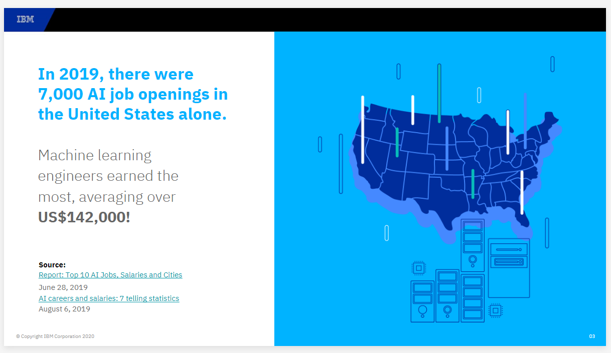

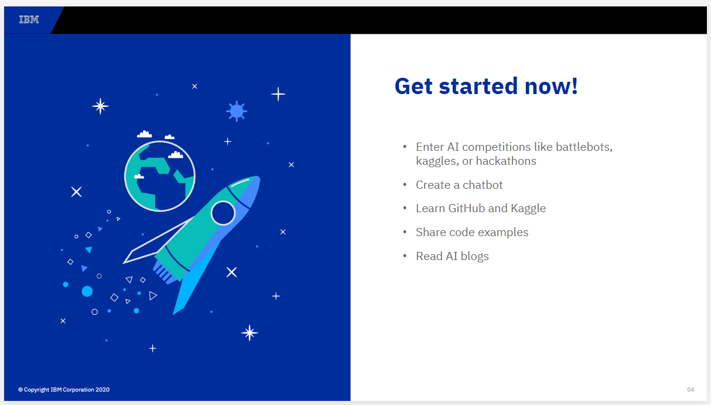

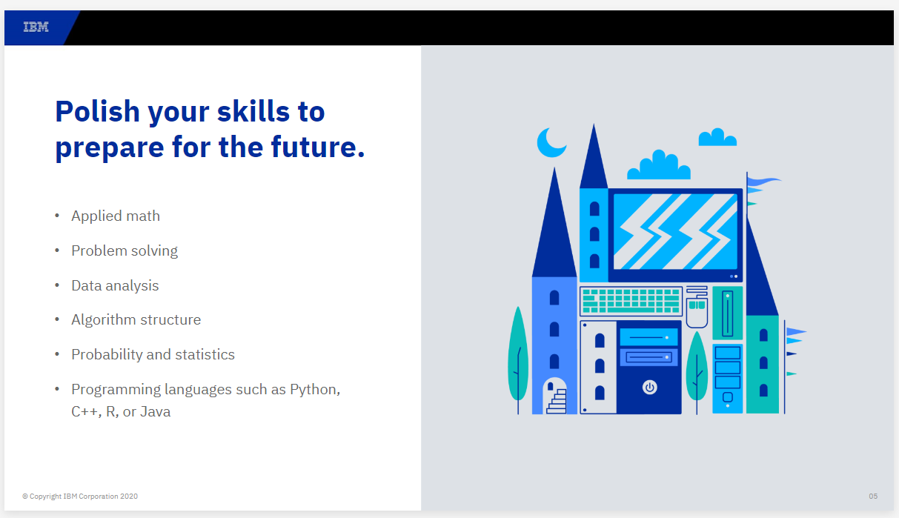

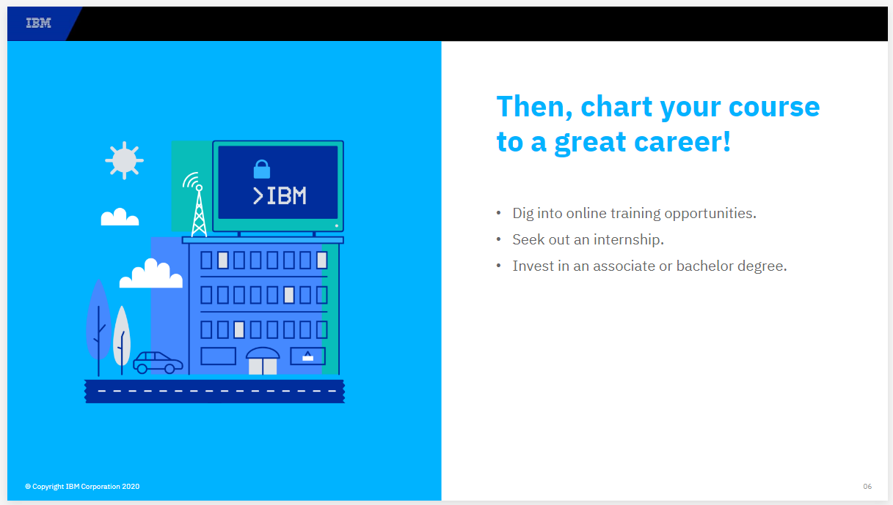

##### Aprende la jerga, ¡Muestra lo que sabes

Te encontrarás con mucha jerga cuando hables de IA. Aquí tienes una guía rápida de términos comunes que querrás conocer.

Haga clic en las secciones para revisar los términos:

**Algoritmos.**

Los algoritmos son instrucciones matemáticas escritas por científicos de datos que le dicen a la máquina cómo encontrar
soluciones a un problema. Cuando una pequeña selección de datos (llamados datos de entrenamiento) se ejecuta repetidamente a
través de un algoritmo, cada vez modificado por un científico de datos hasta que sus resultados sean confiablemente
precisos, el resultado es un modelo que la máquina puede usar para aprendizaje adicional por sí misma.

**chatbot.**

Un chatbot es un programa informático diseñado para simular una conversación con usuarios humanos, especialmente a través de
Internet. Se trata de un asistente que se comunica con nosotros a través de mensajes de texto o de voz y se integra como
compañero virtual en sitios web, aplicaciones o mensajería instantánea.

**Datos.**

Los datos  alimentan la IA. Permite que los sistemas de IA revelen patrones, tendencias y asociaciones con confianza.
Algunos datos están estructurados, lo que significa que se han organizado en un formato que las computadoras pueden leer y
analizar fácilmente, como una base de datos o un archivo de Excel. Otros datos no están estructurados, como tweets, archivos
PDF y archivos de vídeo.

**Aprendizaje profundo.**

El aprendizaje profundo (DL) es un grupo de redes neuronales (que son, a su vez, grupos de modelos de aprendizaje
automático). El aprendizaje profundo puede encontrar patrones en estructuras de datos complejas como imágenes, videos y
sonidos. Muchos de sus modelos no necesitan entrenamiento explícito para encontrar una solución, lo que los hace excelentes
para resolver problemas demasiado grandes y complejos para que los diseñen humanos. El aprendizaje profundo se ha utilizado
para entrenar vehículos autónomos, detectar fraudes e incluso crear vídeos "deepfake" de celebridades populares.

**Aprendizaje automático.**

El aprendizaje automático (ML) es el motor de un sistema de IA. Describe máquinas que aprenden sin instrucciones explícitas
sobre cómo realizar tareas. A menudo depende de modelos: artefactos entrenados que guían a las máquinas cuando interpretan
nuevos datos. Los modelos representan patrones de datos y ayudan a un sistema de aprendizaje automático a hacer predicciones
sin que le digan cómo hacerlo.

**Procesamiento natural del lenguaje.**

El procesamiento del lenguaje natural (PNL) es la capacidad de un programa informático para comprender el lenguaje humano
tal como se habla. La PNL puede entrenar computadoras para procesar grandes cantidades de texto humano, como periódicos o
conversaciones, comprendiendo la intención y el significado de esos datos. Con la PNL, una máquina puede responder a los
humanos con matices y comprensión. Un ejemplo común de PNL es un chatbot de servicio al cliente.

**Redes neuronales.**

Las redes neuronales son grupos de modelos de aprendizaje automático. Simulan las células cerebrales densamente
interconectadas del cerebro humano. Pueden aprender cosas, reconocer patrones y tomar decisiones sin tener que ser
programados explícitamente. Las redes neuronales son capaces de encontrar patrones dentro de datos que son tan complejos que
ningún ser humano podría programar su análisis.

**Aprendizaje reforzado.**

El aprendizaje por refuerzo es un tipo de modelo de aprendizaje automático que no proporciona a la máquina ningún dato,
etiquetado o no. En cambio, la máquina intenta diferentes acciones y recibe señales de recompensa (¡como galletas para un
perro!) cuando realiza los movimientos correctos. De esta forma el sistema está capacitado para resolver un problema, sin
necesidad de trabajo humano.

**Reconocimiento de voz.**

El reconocimiento de voz es una tecnología que puede reconocer palabras habladas, que luego pueden convertirse en texto o
ejecutar un comando hablado. Un subconjunto del reconocimiento de voz es el reconocimiento de voz, que es la tecnología para
identificar a una persona según su voz.

**Aprendizaje supervisado.**

El aprendizaje supervisado es un tipo de modelo de aprendizaje automático que proporciona a la máquina un conjunto de datos
altamente precisos que han sido etiquetados por un humano. La máquina utiliza este modelo para reconocer cosas relacionadas
en conjuntos de datos no entrenados.

**Aprendizaje sin supervisión.**

El aprendizaje no supervisado es un tipo de modelo de aprendizaje automático que no proporciona a la IA ningún dato
etiquetado. En cambio, le proporciona a la IA datos sin etiquetar, y la IA sugiere varias formas de agruparlos y
organizarlos. Esto es valioso cuando los datos son tan grandes o complejos que los humanos no pueden identificar sus
patrones por sí mismos.

**Reconocimiento visual.**

El reconocimiento visual , también conocido como visión por computadora, es un subcampo de la IA centrado en entrenar
computadoras para comprender e interpretar imágenes y videos. Los modelos de reconocimiento visual aprenden a identificar
objetos, personas o atributos individuales en una imagen. Por ejemplo, un modelo podría ayudar a evaluar los accidentes
automovilísticos, identificar el tipo de vehículo involucrado y sus daños, y luego estimar el costo de reparación.

#### La inteligencia artificial en la practica

##### Introducción IA en la practica

**La IA ya es parte de tu vida.**

En 2011, personas de todo el mundo que nunca habían pensado mucho en la inteligencia artificial (IA) se encontraron de
repente con ella: ¡en Jeopardy! , un programa de preguntas de televisión. Tómate un momento para adivinar la respuesta a una
pregunta sobre ese momento histórico:

Cuando los científicos entrenaron el programa de IA de IBM Watson para competir con los campeones del torneo en Jeopardy!,
¿cuál crees que fue su principal fuente de información para que el programa la usara al responder las preguntas del programa
de preguntas ?

A.Wikipedia

B. La Biblioteca del Congreso

C. Un grupo de académicos del MIT

Tenga en cuenta su mejor estimación a medida que continúa. Encontrarás la respuesta más adelante en este curso.

##### La IA puede comunicarse, Hablando natualmente

**La IA entiende el lenguaje humano.**

En cualquier idioma, puede haber cientos de formas de expresar una idea sencilla. Nuestros cerebros han sabido desde la
infancia cómo procesar oraciones y darles sentido. Pero las computadoras no pueden hacer eso usando métodos de programación
tradicionales. ¡Es imposible para un programador inventar la redacción exacta para cada oración posible que alguien podría
decirle a una computadora! En cambio, los científicos de IA han ayudado a las computadoras a comprender el lenguaje
utilizando una rama de la informática llamada procesamiento del lenguaje natural o  PNL.

La PNL impulsa los chatbots , los sistemas computarizados que brindan un servicio básico al cliente. Escribe o pronuncia una
pregunta usando una oración simple y ordinaria. El chatbot normalmente comprende su pregunta y responde en consecuencia.

Encontrará una aplicación avanzada de PNL en los asistentes virtuales proporcionados por teléfonos inteligentes y
dispositivos informáticos personales. Alexa de Amazon, Cortana de Microsoft y Siri de Apple pueden comprender preguntas más
complejas.

A medida que la PNL se vuelve más sofisticada, interactuará con asistentes virtuales avanzados como el ficticio que se
muestra en este video.

<https://youtu.be/vvimBPJ3XGQ>

##### La IA puede ayudarte a hacer cosas, Conducir y comprar

**La IA puede realizar tareas difíciles en su nombre.**

La IA puede realizar trabajos complejos que antes se pensaba que sólo eran posibles para los humanos. Pensemos en los coches
autónomos. Utilizando cámaras, radar, lidar y GPS, reciben todo tipo de información: superficie de la carretera, límite de
velocidad, líneas de carril, tráfico, peatones, condiciones de iluminación, señales de tráfico y más, ¡todo cambiando a la
velocidad de la autopista! Su IA integra rápidamente estas entradas y toma decisiones para navegar por la carretera de forma
segura y precisa.

**La IA puede ayudarte a descubrir cosas.**

La IA también puede automatizar búsquedas, marketing y publicidad. Al analizar automáticamente datos sobre su comportamiento
y preferencias, la IA puede hacer predicciones o recomendaciones que sean específicas para usted o que reflejen a personas
similares a usted.

Amazon, por ejemplo, recuerda los libros que has comprado y te sugiere otros que también podrían interesarte. LinkedIn
recomienda trabajos que se adapten a tu perfil. Netflix recomienda programas similares a los que ya has disfrutado. En este
momento, estas recomendaciones tienen un valor mixto. Si compras calcetines en Amazon, te recomendará más calcetines, los
necesites o no. Pero este tipo de IA está avanzando rápidamente en su capacidad para personalizar lo que ofrece. Descubre
más en el siguiente vídeo.

<https://youtu.be/JwHzqYN0WTA>

Otro gran ejemplo, uno que no se trata de ventas sino de ayudar a las personas, es IBM Watson for Oncology . Lee cada
palabra y resultado de la prueba de un paciente con cáncer individual. Al mismo tiempo, se mantiene al tanto de más
publicaciones de investigación sobre el cáncer de las que un ser humano podría leer. Combinando lo que ha aprendido sobre el
paciente con lo que ha aprendido de la investigación, hace recomendaciones de tratamiento adaptadas precisamente al
paciente.

##### La IA puede resolver problemas, Salvando vidas

**La IA puede ayudar a la humanidad.**

En la región de Patna, en el norte de la India, propensa a inundaciones, las aguas estaban subiendo. Pero gracias en parte a
un sistema de inteligencia artificial, los residentes de la región recibieron alertas tempranas en sus teléfonos. ¡Un
sistema de pronóstico de inundaciones que Google desarrolló para la Comisión Central del Agua de la India está marcando la
diferencia! Pero puede hacer más que pronosticar mareas altas. También es lo suficientemente inteligente como para evitar
falsas alarmas.

Sella Nevo, jefe de la unidad de previsión de inundaciones y director de ingeniería de software de Google, señala que “para
nuestras alertas de alto riesgo, tuvimos menos del 10 por ciento de falsos positivos [hasta regiones que miden 64 por 64
metros]... Eso es alta precisión." El truco consiste en entrenar la precisión del sistema para evitar evacuaciones
innecesarias y generar confianza en el sistema de alerta.

**Pero las buenas soluciones requieren buenos datos.**

Si usted o sus amigos disfrutan de la programación informática, probablemente hayan escuchado el acrónimo GIGO. Significa
"basura que entra, basura que sale". Cuando trabajas con datos incorrectos obtendrás malos resultados.

GIGO también se aplica a la IA. El sistema más brillante no puede resolver problemas sin datos de alta calidad. No basta con
diseñar bien el sistema. También debe darle la capacidad de detectar información falsa y limpiar la información que contiene
errores.

##### La IA puede jugar, ¡No sólo por diversión

**Aplicaciones de juegos para IA.**

Algunas de las aplicaciones más famosas de la inteligencia artificial han surgido del mundo de los juegos. Averigüemos cómo.

Comienza con programas diseñados para ganar juegos difíciles. Durante años, los mayores maestros del ajedrez del mundo han
puesto a prueba sus habilidades contra oponentes informáticos: desde el Deep Blue de IBM hasta el actual campeón, Stockfish
9. Este tipo de IA avanzada pero limitada no puede pilotar un coche autónomo ni mantener una conversación. , o proporcionar
advertencias precisas sobre inundaciones, pero está invicto contra los mejores jugadores de ajedrez humanos del mundo.

Ya has leído cómo el procesamiento del lenguaje natural ayudó a IBM Watson a ganar el concurso Jeopardy! campeonato (junto
con un enorme conjunto de datos extraídos de Wikipedia y otras fuentes). Veamos los movimientos ganadores de Watson en el
siguiente video.

Algunas personas piensan que los juegos son una forma divertida pero trivial de utilizar la IA. Escuchamos esto, por
ejemplo, cuando Jeopardy! win se emitió por primera vez. Pero las lecciones aprendidas de esa aventura ayudaron a IBM a
abordar enormes problemas como el transporte global y el tratamiento del cáncer. Los sistemas de juego ofrecen desafíos
complicados y de rápido movimiento cuyas soluciones nos llevan a nuevas e importantes aplicaciones de IA.

##### La IA puede ampliar la experiencia humana, Haciéndonos más inteligentes

**Aumento de inteligencia.**

Hay otra forma de ver la inteligencia artificial: en lugar de tomar decisiones por nosotros, podemos diseñarla para
ayudarnos a tomar mejores decisiones. A esto lo llamamos  aumento de inteligencia .  Se refiere al desarrollo de
herramientas computarizadas que complementan el pensamiento humano.

### Ciberseguridad

#### Que es la ciberseguridad

##### Introducción a la ciberseguridad

**¡Bienvenido a la ciberseguridad para principiantes!**

Su objetivo es aprender terminología, conceptos y funciones clave en el campo de la ciberseguridad, incluidos temas como
cifrado, criptografía y ciberataques. Este curso incluye tres videos para ayudarlo a ponerse al día con estos temas. Al
final, pondrás a prueba tus conocimientos con un cuestionario. Para comenzar, haga clic en ¡ Lo revisé!

##### La seguridad cibernética

Si bien las computadoras se han interconectado y nos permiten comunicarnos en todo el mundo, no todos los que usan estas
redes siguen las reglas o tienen en mente nuestros mejores intereses. ¡Aprenda sobre contraseñas, datos biométricos,
piratería y más!

Sumérgete de cabeza en el fascinante y vertiginoso mundo de la ciberseguridad con este vídeo de Crash Course.

<https://youtu.be/bPVaOlJ6ln0>

*Conclusiones clave.*

La ciberseguridad ayuda a minimizar los delitos y los daños en el mundo virtual. Piense en ello como un conjunto de técnicas
para proteger el secreto, la integridad y la disponibilidad de los sistemas informáticos y los datos contra amenazas.

La autenticación se refiere al proceso mediante el cual una computadora comprende con quién está interactuando. Hay tres
tipos de autenticación: lo que sabes, lo que tienes y lo que eres.

A menudo, los expertos en seguridad sugieren utilizar dos o más formas de autenticación (autenticación de dos factores o de
múltiples factores) para cuentas importantes.

Los permisos o listas de control de acceso (ACL) describen el acceso que tiene cada usuario para ver o modificar cualquier
archivo, carpeta o programa en una computadora.

El software malicioso llamado malware puede hacer que un programa o sistema informático sea vulnerable a ataques que copian
datos del usuario y permiten a los piratas informáticos disfrazarse del usuario.

##### Hackers y ciberataques

Este vídeo analiza algunos ejemplos clásicos de las formas en que los piratas informáticos irrumpen en los sistemas
informáticos. Sumérgete en el fascinante y vertiginoso mundo de la ciberseguridad con esta inmersión profunda en los hackers
de “Sombrero Negro” y “Sombrero Blanco”, y las estrategias que utilizan para el bien y el mal.

<https://youtu.be/_GzE99AmAQU>

*Conclusiones clave.*

Los piratas informáticos utilizan sus conocimientos técnicos para acceder a los sistemas informáticos. Los piratas
informáticos Black Hat tienen intenciones maliciosas de robar, explotar y vender vulnerabilidades y datos informáticos.

Los hackers de sombrero blanco son contratados por empresas y gobiernos para realizar evaluaciones de seguridad, buscar
errores e intentar cerrar agujeros de seguridad en el software para hacer que los sistemas sean más seguros y resistentes.

Algunos piratean por diversión y curiosidad, mientras que los ciberdelincuentes piratean con mayor frecuencia para obtener
ganancias monetarias. Los miembros de la comunidad hacktivista utilizan sus habilidades para promover un objetivo social o
político.

Los atacantes encuentran y aprovechan un error en un sistema para obtener acceso a los sistemas informáticos y sobrescribir
datos, robar datos de usuario, bloquear sistemas o incluso utilizar ese error explotable para secuestrar todo el sistema.

Un nuevo error explotable que los creadores de software desconocen se llama vulnerabilidad de día cero. Los hackers de Black
Hat se apresuran a utilizar el exploit para obtener el máximo beneficio antes de que los programadores de White Hat puedan
lanzar un parche para el error.

Es importante mantener actualizado el software de la computadora, especialmente con los parches de seguridad. Los errores
que se dejan abiertos en suficientes sistemas permiten a los piratas informáticos escribir un programa llamado "gusano" que
salta automáticamente de una computadora a otra.

##### Criptografía

En este video final, aprenderá sobre formas comunes de seguridad informática llamadas criptografía y partes clave de la
criptografía moderna, como el cifrado simétrico, el intercambio de claves y la criptografía de clave pública.

<https://youtu.be/jhXCTbFnK8o>

Transcripción del Video Criptografía: Crash Course Computer Science #33

Hola, soy Carrie Anne, ¡y bienvenidos a Crash Course Computer Science! En los dos últimos episodios, hemos hablado mucho
sobre la seguridad informática. Pero la realidad es que no existe un sistema informático perfectamente seguro al 100%.
Siempre habrá errores y los expertos en seguridad lo saben. Por lo tanto, los arquitectos de sistemas emplean una estrategia
llamada defensa en profundidad, que utiliza muchas capas de mecanismos de seguridad variados para frustrar a los atacantes.
Es un poco como están diseñados los castillos: primero tienes que esquivar a los arqueros, luego cruzar el foso, escalar las
murallas, evitar el aceite caliente, superar los parapetos y derrotar a los guardias antes de llegar a la sala del trono,
pero en este caso estamos hablando de una de las formas más comunes de seguridad informática: la criptografía.

INTRO

La palabra criptografía proviene de las raíces 'crypto' y 'graphy', que se traduce aproximadamente como "escritura secreta".
Para hacer que la información sea secreta, se usa un cifrado: un algoritmo que convierte el texto en claro en texto cifrado,
que es un galimatías a menos que tengas una clave que te permita deshacer el cifrado. El proceso de hacer que el texto sea
secreto se llama encriptación, y el proceso inverso se llama desencriptación. Los cifrados se han usado mucho antes de que
aparecieran las computadoras. Julio César usaba lo que ahora se llama un cifrado César para encriptar correspondencia
privada. Él desplazaba las letras de un mensaje hacia adelante tres lugares. Así, A se convertía en D, y la palabra "brutus"
se convertía en esto: "euxwxv". Para descifrar el mensaje, los destinatarios tenían que conocer tanto el algoritmo como el
número de desplazamiento, que actuaba como la clave. El cifrado César es un ejemplo de una clase más grande de técnicas
llamadas cifrados por sustitución. Estos reemplazan cada letra de un mensaje con otra cosa según una traducción. Un gran
inconveniente de los cifrados de sustitución básicos es que las frecuencias de las letras se conservan. Por ejemplo, E es la
letra más común en inglés, por lo que si tu cifrado traduce E a X, entonces X aparecerá con más frecuencia en el texto
cifrado. Un criptanalista hábil puede trabajar hacia atrás a partir de este tipo de estadísticas para descifrar el mensaje.
Fue la ruptura de un cifrado de sustitución lo que llevó a la ejecución de María, Reina de Escocia, en 1587 por conspirar
para matar a la Reina Isabel. Otra clase fundamental de técnicas son los cifrados por permutación. Veamos un ejemplo simple,
llamado cifrado de transposición columnar. Aquí, tomamos un mensaje y llenamos las letras en una cuadrícula. En este caso,
hemos elegido 5 por 5. Para encriptar nuestro mensaje, leemos los caracteres en un orden diferente, digamos desde la esquina
inferior izquierda, trabajando hacia arriba, una columna a la vez. El nuevo orden de las letras, lo que se llama una
permutación, es el mensaje encriptado. La dirección del orden, así como el tamaño de la cuadrícula 5 por 5, sirve como la
clave. Como antes, si se conoce el cifrado y la clave, un destinatario puede revertir el proceso para revelar el mensaje
original. Para la década de 1900, la criptografía se mecanizó en forma de máquinas de encriptación. La más famosa fue la
Enigma alemana, utilizada por los nazis para encriptar sus comunicaciones durante la guerra. Como discutimos en el episodio
15, la Enigma era una máquina parecida a una máquina de escribir, con un teclado y un panel de lámparas, ambos mostrando el
alfabeto completo. Encima de eso, había una serie de rotores configurables que eran la clave para la capacidad de
encriptación de la Enigma.

2 Primero, veamos un solo rotor. Un lado tenía contactos eléctricos para las 26 letras. Estos se conectaban al otro lado del
rotor mediante cables cruzados que intercambiaban una letra por otra. Si entraba una 'H', podría salir una 'K' al otro lado.
Si entraba una 'K', podría salir una 'F', y así sucesivamente. Este comportamiento de intercambio de letras debería sonar
familiar: ¡es un cifrado por sustitución! Pero la Enigma era más sofisticada porque usaba tres o más rotores en fila, cada
uno alimentando al siguiente. Los rotores también podían girarse a una de las 26 posiciones posibles de inicio, y podían
insertarse en diferentes órdenes, proporcionando muchas diferentes asignaciones de sustitución. Después de los rotores había
un circuito especial llamado reflector. En lugar de pasar la señal a otro rotor, conectaba cada pin a otro, y enviaba la
señal eléctrica de vuelta a través de los rotores. Finalmente, había un tablero de enchufes en la parte frontal de la
máquina que permitía que las letras que venían del teclado se intercambiaran opcionalmente, añadiendo otro nivel de
complejidad. Con nuestro circuito simplificado, encriptamos una letra en esta configuración de ejemplo de la Enigma. Si
presionamos la tecla ‘H’, la electricidad fluye a través del tablero de enchufes, luego los rotores, llega al reflector,
regresa a través de los rotores y el tablero de enchufes, y enciende la letra ‘L’ en el panel de lámparas. Así, H se
encripta como L. Nota que el circuito puede fluir en ambas direcciones: si escribimos la letra ‘L’, ‘H’ se encendería. En
otras palabras, es el mismo proceso para encriptar y desencriptar; solo tienes que asegurarte de que las máquinas emisora y
receptora tengan la misma configuración inicial. Si observas detenidamente este circuito, notarás que es imposible que una
letra se encripte como sí misma, lo que resultó ser una debilidad criptográfica fatal. Finalmente, para evitar que la Enigma
fuera un simple cifrado por sustitución, cada vez que se introducía una letra, los rotores avanzaban un lugar, un poco como
el cuentakilómetros de un coche. Así que, si introducías el texto A-A-A, podría salir como B-D-K, donde la asignación de
sustituciones cambiaba con cada pulsación de tecla. La Enigma era un hueso duro de roer, sin duda. Pero como discutimos en
el episodio 15, Alan Turing y sus colegas en Bletchley Park pudieron romper los códigos Enigma y automatizar en gran medida
el proceso. Pero con la llegada de las computadoras, la criptografía pasó del hardware al software. Uno de los primeros
cifrados de software en volverse generalizado fue el Estándar de Encriptación de Datos desarrollado por IBM y la NSA en
1977. DES, como se le conocía, originalmente usaba claves binarias de 56 bits de largo, lo que significa que había 2 a la
56, o unos 72 cuatrillones de claves diferentes. En 1977, eso significaba que nadie, excepto quizás la NSA, tenía suficiente
poder de computación para forzar todas las claves posibles. Pero, en 1999, una computadora de un cuarto de millón de dólares
podía probar todas las claves posibles de DES en solo dos días, haciendo que el cifrado fuera inseguro. Así que, en 2001, se
finalizó y publicó el Estándar de Encriptación Avanzada (AES). AES está diseñado para usar claves mucho más grandes: de 128,
192 o 256 bits de tamaño, haciendo los ataques de fuerza bruta mucho, mucho más difíciles. Para una clave de 128 bits,
necesitarías billones de años para probar cada combinación, incluso si usaras cada computadora en el planeta hoy en día. Así
que, ¡mejor empieza ya! AES divide los datos en bloques de 16 bytes, y luego aplica una serie de sustituciones y
permutaciones, basadas en el valor de la clave, además de algunas otras operaciones para oscurecer el mensaje, y este
proceso se repite diez o más veces para cada bloque. Podrías preguntarte: ¿por qué solo diez rondas? ¿O por qué solo claves
de 128 bits, y no claves de diez mil bits? Bueno, es una compensación de rendimiento. Si llevara horas encriptar y enviar un
correo electrónico, o minutos conectarse a un sitio web seguro, la gente no lo usaría.

3 AES equilibra rendimiento y seguridad para proporcionar una criptografía práctica. Hoy en día, AES se usa en todas partes,
desde encriptar archivos en iPhones y transmitir datos a través de WIFI con WPA2, hasta acceder a sitios web usando HTTPS.
Hasta ahora, las técnicas criptográficas que hemos discutido dependen de claves que son conocidas tanto por el remitente
como por el destinatario. El remitente encripta un mensaje usando una clave, y el destinatario lo desencripta usando la
misma clave. En los viejos tiempos, las claves se compartían por voz, o físicamente; por ejemplo, los alemanes distribuían
libros de códigos con configuraciones diarias para sus máquinas Enigma. Pero esta estrategia nunca podría funcionar en la
era de Internet. ¡Imagina tener que abrir un libro de códigos para conectarte a YouTube! Lo que se necesita es una manera
para que un servidor envíe una clave secreta a través de Internet pública a un usuario que desee conectarse de forma segura.
Parece que eso no sería seguro, porque si la clave se envía abiertamente y es interceptada por un hacker, ¿no podrían usar
eso para desencriptar toda la comunicación entre los dos? La solución es el intercambio de claves: ¡un algoritmo que permite
a dos computadoras acordar una clave sin necesidad de enviar una! Podemos hacer esto con funciones unidireccionales:
operaciones matemáticas que son muy fáciles de hacer en una dirección, pero difíciles de revertir. Para mostrar cómo
funcionan las funciones unidireccionales, usemos colores de pintura como analogía. Es fácil mezclar colores de pintura, pero
no es tan fácil averiguar los colores constituyentes que se usaron para hacer un color de pintura mezclado. Tendrías que
probar muchas posibilidades para descubrirlo. En esta metáfora, nuestra clave secreta es un tono único de pintura. Primero,
hay un color de pintura público que todos pueden ver. Luego, John y yo elegimos cada uno un color de pintura secreto. Para
intercambiar claves, mezclo mi color de pintura secreto con el color de pintura público. Luego, envío ese color mezclado a
John por cualquier medio: correo, paloma mensajera, lo que sea. John hace lo mismo: mezcla su color de pintura secreto con
el color público, luego me lo envía. Cuando recibo el color de John, simplemente agrego mi color privado para crear una
mezcla de los tres colores de pintura. John hace lo mismo con mi color mezclado. ¡Y voila! ¡Ambos terminamos con el mismo
color de pintura! Podemos usar esto como un secreto compartido, aunque nunca nos enviamos nuestros colores secretos
individuales. Un observador externo que esté espiando sabría información parcial, pero les resultaría muy difícil descubrir
nuestro color secreto compartido. Por supuesto, enviar y mezclar colores de pintura no va a funcionar bien para transmitir
datos informáticos. Pero afortunadamente, las funciones unidireccionales matemáticas son perfectas, y esto es lo que usa el
Intercambio de Claves Diffie-Hellman. En Diffie-Hellman, la función unidireccional es la exponenciación modular. Esto
significa tomar un número, la base, elevarlo a la potencia de otro número, el exponente, y tomar el resto al dividir por un
tercer número, el módulo. Así que, por ejemplo, si quisiéramos calcular 3 elevado a la 5ª potencia, módulo 31, calcularíamos
3 elevado a la 5ª, que es 243, luego tomamos el resto al dividir por 31, que es 26. La parte difícil es averiguar el
exponente dado solo el resultado y la base. Si te digo que elevé 3 a algún número secreto, módulo 31, y obtuve 7 como resto,
tendrías que probar muchos exponentes para saber cuál elegí. Si hacemos estos números grandes, digamos de cientos de dígitos
de longitud, entonces encontrar el exponente secreto es casi imposible. Ahora hablemos de cómo Diffie-Hellman usa la
exponenciación modular para calcular una clave compartida. Primero, hay un conjunto de valores públicos: la base y el
módulo, que, como nuestro color de pintura público, todos pueden conocer... ¡incluso los malos!

4 Para enviar un mensaje de forma segura a John, elegiría un exponente secreto: X. Luego, calcularía B elevado a la X,
módulo M. Envío este gran número a John. John hace lo mismo, eligiendo un exponente secreto Y, y enviándome B elevado a la
Y, módulo M. Para crear una clave secreta compartida, tomo lo que John me envió, y lo elevo a la potencia de X, mi exponente
secreto. Esto es matemáticamente equivalente a B elevado a la XY, módulo M. John hace lo mismo, tomando lo que le envié a la
potencia de Y, y ambos terminamos con el mismo número exacto. ¡Es una clave secreta compartida, aunque nunca nos enviamos
nuestros números secretos! Podemos usar este gran número como una clave compartida para la comunicación encriptada, usando
algo como AES para la encriptación. El intercambio de claves Diffie-Hellman es un método para establecer una clave
compartida. Estas claves que pueden ser usadas tanto por el remitente como por el receptor, para encriptar y desencriptar
mensajes, se llaman claves simétricas porque la clave es la misma en ambos lados. El Cifrado César, Enigma y AES son todas
encriptaciones simétricas. También hay encriptación asimétrica, donde hay dos claves diferentes, más comúnmente una que es
pública y otra que es privada. Así, las personas pueden encriptar un mensaje usando una clave pública que solo el
destinatario, con su clave privada, puede desencriptar. En otras palabras, conocer la clave pública solo te permite
encriptar, pero no desencriptar: ¡es asimétrico! Así que piensa en cajas con candados que puedes abrir con una llave. Para
recibir un mensaje seguro, puedo darle al remitente una caja y un candado. Ellos ponen su mensaje en ella y la cierran.
Ahora, pueden enviarme esa caja y solo yo puedo abrirla, con mi clave privada. Después de cerrar la caja, ni el remitente,
ni nadie más que encuentre la caja, puede abrirla sin usar fuerza bruta. De la misma manera, una clave pública digital puede
encriptar algo que solo puede ser desencriptado con una clave privada. El proceso inverso también es posible: encriptar algo
con una clave privada que puede ser desencriptado con una clave pública. Esto se usa para firmar, donde un servidor encripta
datos usando su clave privada. Cualquiera puede desencriptarlo usando la clave pública del servidor. Esto actúa como una
firma infalsificable, ya que solo el propietario, usando su clave privada, puede encriptar. Prueba que estás recibiendo
datos del servidor o persona correctos, y no de un impostor. La técnica de encriptación asimétrica más popular utilizada hoy
en día es RSA, llamada así por sus inventores: Rivest, Shamir y Adleman. Así que ahora conoces todas las partes "clave" de
la criptografía moderna: encriptación simétrica, intercambio de claves y criptografía de clave pública. Cuando te conectas a
un sitio web seguro, como tu banco, ese pequeño icono de candado significa que tu computadora ha utilizado criptografía de
clave pública para verificar el servidor, intercambio de claves para establecer una clave temporal secreta, y encriptación
simétrica para proteger toda la comunicación de ida y vuelta de miradas indiscretas. Ya sea que estés comprando algo en
línea, enviando correos electrónicos a tus mejores amigos, o simplemente navegando videos de gatos, la criptografía mantiene
todo eso seguro, privado y protegido. ¡Gracias, criptografía!

**Conclusiones clave.**

Las formas más comunes de seguridad informática se conocen como criptografía. Los arquitectos de sistemas emplean estas
estrategias para mantener la información en secreto y frustrar a los atacantes.

Un cifrado es un algoritmo que convierte texto sin formato en texto cifrado, lo cual no tiene sentido a menos que tenga una
clave que le permita deshacer el cifrado. El proceso de hacer que el texto sea secreto se llama cifrado y el proceso inverso
se llama descifrado.

Las técnicas criptográficas se basan en claves conocidas tanto por el remitente como por el destinatario. El remitente cifra
un mensaje utilizando una clave y el destinatario lo descifra utilizando la misma clave.

El intercambio de claves utiliza un algoritmo que permite que dos computadoras acuerden una clave sin tener que enviarla,
utilizando funciones unidireccionales (operaciones matemáticas) que son fáciles de realizar en una dirección, pero difíciles
de revertir.

Las claves que pueden utilizar tanto el remitente como el receptor para cifrar y descifrar mensajes se denominan claves
simétricas porque la clave es la misma en ambos lados.

El cifrado asimétrico utiliza dos claves diferentes, normalmente una pública y otra privada. Los remitentes pueden cifrar un
mensaje utilizando una clave pública que sólo el destinatario, con su clave privada, puede descifrar.

##### Carreras en ciberseguridad, Infografía

La ciberseguridad abarca todos los roles laborales e industrias, y todas las empresas necesitan algún tipo de solución de
seguridad. Quizás se pregunte qué habilidades necesita para enfrentar las amenazas a la seguridad o cuáles son los trabajos
interesantes en este campo. Las respuestas a estas preguntas, además de algunos datos más, se incluyen en la siguiente
infografía y artículo.

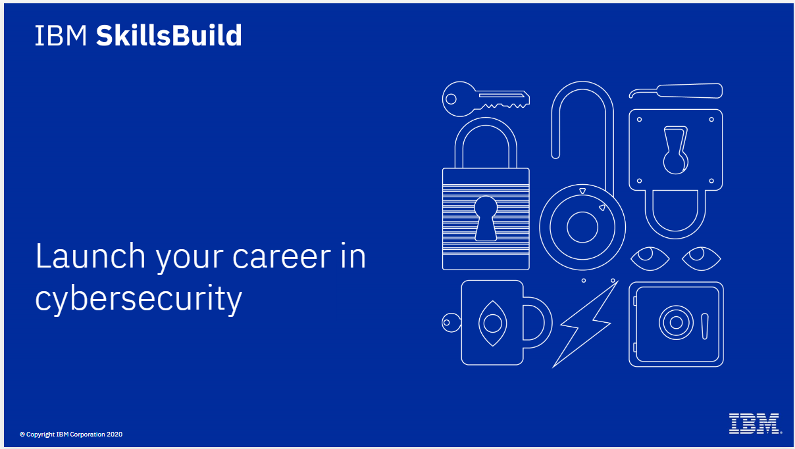

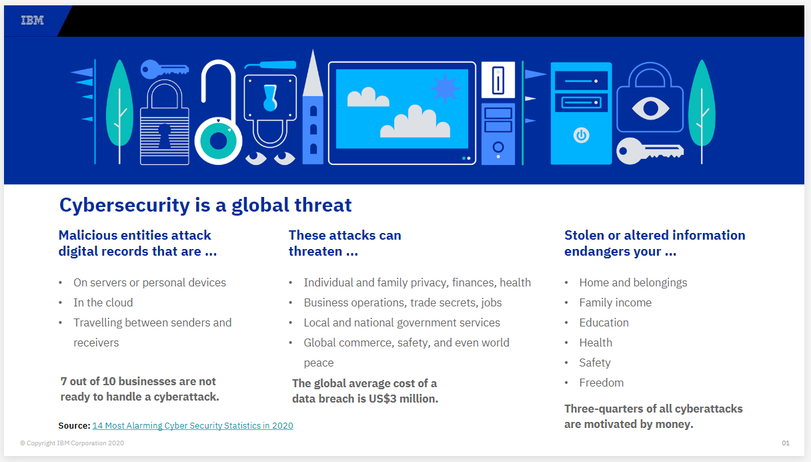

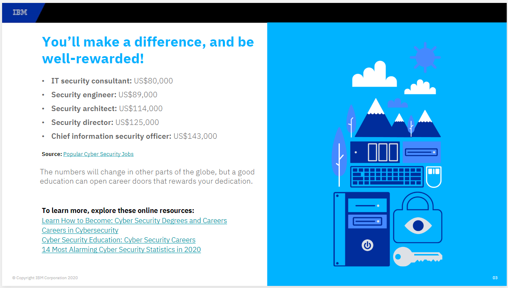

<https://bundles.yourlearning.ibm.com/skills/learn/assets/XVPQVZGJWWQV55Y8/Blog_How%20to%20land%20a%20career%20in%20cybersecurity_English.pdf>

#### como se utiliza la ciberseguuridad

##### Introducción uso de la ciberseguridad

En este curso, aprenderá sobre Havyn, el asistente de ciberseguridad habilitado por voz, y los inventores, padre e hijo, que
lo concibieron por primera vez.

También verá y seguirá cómo un equipo de seguridad de IBM aísla un ciberataque y cierra la amenaza. Entonces tendrás la
oportunidad de probarlo por ti mismo y poner a prueba tus habilidades de ciberdefensa con el Laboratorio de ciberseguridad
de NOVA.

Tres videos lo ayudarán a comprender cómo se utiliza la ciberseguridad para defenderse de los ataques, y un cuestionario y
un laboratorio a continuación pondrán a prueba sus conocimientos.

¡Divertirse!

##### Tony Stark tiene a Jarvis y ahora IBM tiene a Havyn

Lo que comenzó como un proyecto de fin de semana, creció hasta convertirse en un asistente de voz local que aprovecha la
enorme infraestructura de ciberseguridad de IBM.

Al igual que el asistente de voz Alexa de Amazon, Havyn ayuda a combatir las amenazas de ciberseguridad respondiendo
consultas básicas utilizando un chatbot y una interfaz de voz basados ​​en Watson. La herramienta puede determinar si
existen ciberamenazas e identificar los sistemas a los que afecta.

Dado que Havyn puede manejar múltiples hilos de conversación, la investigación de IBM estima que los equipos manejan un
promedio de 200.000 eventos individuales cada día. Eso es más de lo que cualquier equipo humano de ciberseguridad podría
esperar procesar, lo que convierte a Hayvn en un excelente complemento para los flujos de trabajo de ciberseguridad
actuales. Esta herramienta libera a los equipos para las ciberamenazas que requieren su atención con mayor urgencia.

Aún no está claro qué tan útil podría llegar a ser Hayvn o cómo lo utilizarán los analistas. ¿Cómo cree que Havyn ayudará a
los analistas a responder a las ciberamenazas?

<https://www.wired.com/2017/02/ibm-havyn-cybersecurity/>

*Conclusiones clave.*

Havyn comenzó como un experimento en tecnología de voz a texto (STT), texto a voz (TTS) y conversacional impulsado por
Watson, diseñado para combatir las amenazas de ciberseguridad respondiendo preguntas básicas.

Hayvn puede determinar si existe una ciberamenaza y si afecta directamente a un sistema determinado. Los analistas de
ciberseguridad realizan muchas tareas que requieren mucho tiempo mientras navegan por múltiples sistemas y bases de datos.
La capacidad de Havyn

para responder múltiples consultas a la vez tiene el potencial de complementar en gran medida los flujos de trabajo de
ciberseguridad actuales.

*La Raspberry Pi, que es?*

¡La Raspberry Pi es una computadora versátil que se puede convertir en casi cualquier cosa!

Es una computadora del tamaño de una tarjeta de crédito de bajo costo que se conecta a un monitor de computadora o a un
televisor. Ayuda a personas de todas las edades a explorar la informática y aprender a programar en lenguajes como Scratch y
Python. Tiene una versión ligera de un sistema operativo Linux llamado Raspbian.

Es una excelente manera de aprender más sobre programación de computadoras con proyectos divertidos, como la creación de
parlantes domésticos inalámbricos, un centro multimedia para su televisor e incluso un servidor web personal.

##### Centro de comando IBM X-Force

Los IBM X-Force Command Centers representan un salto cuántico en las capacidades centrales de IBM Security. Los centros se
basan en las últimas soluciones de seguridad cognitiva y los mejores talentos de la industria. Al combinar tecnología líder,
procesos probados en la industria y aportes de expertos en seguridad capacitados, los IBM X-Force Command Centers ayudan a
las empresas a mantenerse a la vanguardia incluso de las amenazas más avanzadas.

Los participantes operan herramientas reales, investigan infecciones activas y responden a eventos de ciberseguridad
internos y externos. Vea cómo es entrenar en un IBM X-Force Command Center, donde la tecnología cognitiva de vanguardia y
los expertos en ciberdefensa de IBM combinan fuerzas para ayudar a las organizaciones a identificar y combatir amenazas de
seguridad avanzadas.

Conclusiones clave

Un IBM X-Force Command Center proporciona habilidades críticas de liderazgo en crisis relacionadas con la ciberseguridad en
un entorno seguro donde los participantes pueden experimentar los efectos del malware en vivo, la denegación de servicio
distribuido (DDoS) y otros ataques tradicionales y avanzados. IBM X-Force Command Center es una instalación de última
generación que sumerge a clientes actuales y potenciales en un Centro de Operaciones de Seguridad (SOC) simulado. Sus
tácticas y protocolos están diseñados para anticipar y defenderse contra amenazas cibernéticas actuales y futuras.

##### Centro de comando X-Force: experiencia Cyber ​​Range 360

Este vídeo es una experiencia simulada del X-Force Command Center: 360 Cyber ​​Range Experience.

Usted es el director de seguridad de la información (CISO) en esta demostración en video 360 del IBM X-Force Command Center.
Experimente el Cyber ​​Range "sandbox", donde el equipo mantiene a raya una infracción grave bajo la dirección de un general
de ciberseguridad de IBM.

##### Laboratorio de Ciberseguridad NOVA, Actividad opcional

**¡Toma la ciberseguridad en tus propias manos!**

En esta práctica de laboratorio, defenderá una empresa que es blanco de ataques cibernéticos cada vez más sofisticados. Su
tarea es fortalecer sus defensas cibernéticas y frustrar a los atacantes completando una serie de desafíos de
ciberseguridad. Descifrarás contraseñas, crearás códigos y derrotarás a piratas informáticos maliciosos.

Diviértete y prueba tus habilidades de ciberdefensa en el NOVA Cybersecurity Lab. ¿Tiene lo necesario para combatir a los
ciberpiratas y atacantes?

**¡JUEGA Y PROTÉGETE CONTRA LOS CIBERATAQUES!**

En el Laboratorio de Ciberseguridad de NOVA, ayudarás a proteger una empresa que es blanco de ataques cibernéticos cada vez
más sofisticados. Debes fortalecer continuamente tus defensas para frustrar a estos atacantes.

Lo harás completando desafíos que te brindarán habilidades básicas de codificación, te ayudarán a detectar estafas diseñadas
para engañarte para que reveles tus secretos y te enseñarán cómo descifrar y fortalecer las contraseñas.

<https://www.pbs.org/wgbh/nova/labs/lab/cyber/>

#### IBM y ciberseguuridad

##### Introducción IBM y ciberseguridad

¡Profundicemos en la ciberseguridad!

Este tema le ayudará a dominar la terminología básica de ciberseguridad y a comprender cómo IBM Security ayuda a los
clientes a defenderse de los ciberataques y responder a amenazas de seguridad más amplias.

Comience con un video y una lista de términos de ciberseguridad que vale la pena conocer. Luego, aprenda los métodos comunes
de ataques cibernéticos.

##### ¿Cómo es trabajar en IBM Security?

Ciberseguridad... ¡mucho más divertida de lo que pensabas! ¿Quizás se esté preguntando cuáles son los roles en
ciberseguridad y las habilidades necesarias para trabajar en este campo?

##### Introducción a la terminología de ciberseguridad

**Volver a lo básico.**

Para conversar sobre amenazas, ataques, defensas y más a la ciberseguridad, es necesario comprender la terminología.

El panorama de la ciberseguridad es amplio, por lo que no cubriremos todos los términos aplicables. Pero revisaremos un
subconjunto útil de términos comunes como los de esta nube de palabras:

Amenaza persistente avanzada (APT)

Una amenaza persistente avanzada (APT) es un ataque de red de varias fases y a largo plazo en el que usuarios no autorizados
obtienen acceso y recopilan datos empresariales valiosos.

El gusano Stuxnet , lanzado en 2010, es un ejemplo de APT.

Red de bots

Una botnet es un grupo de sistemas informáticos, en cualquier parte del mundo, que han sido infectados por un software
malicioso. El software permite que un hacker conecte en red estas computadoras. El pirata informático obtiene el control
total de todos los bots de la red y puede realizar tareas maliciosas.

Un ejemplo de botnet es el  Twitter Botnet de “Star Wars” , lanzado en 2017.

Incumplimiento

Una infracción es el momento en que un usuario no autorizado o un intruso (hacker) explota con éxito una vulnerabilidad en
una computadora o dispositivo y obtiene acceso a sus archivos y red.

Un ejemplo de infracción es Yahoo! violación de datos en septiembre de 2016, en la que se afectaron 3 mil millones de
cuentas de usuarios.

Ataque cibernetico

Un ciberataque es un intento malicioso de dañar, interrumpir u obtener acceso no autorizado a sistemas, redes o dispositivos
informáticos, a través de medios cibernéticos.

Un ejemplo de ciberataque es el ciberataque de 2013 lanzado contra los grandes almacenes Target . El ciberataque afectó a 40
millones de cuentas de tarjetas de crédito y débito de clientes de Target.

La seguridad cibernética

La ciberseguridad implica la preservación de la confidencialidad, integridad y disponibilidad de la información en el
ciberespacio.

I BM Security es un ejemplo de organización dedicada a la ciberseguridad.

Exploit

Un exploit informático implica el uso de una aplicación o script malicioso para aprovechar la vulnerabilidad de una
computadora.

Un ejemplo de explotación informática es la filtración de datos de Equifax en septiembre de 2017 , que resultó de una
vulnerabilidad en la infraestructura de aplicaciones web de la empresa.

malware

Malware es un término general que describe todas las formas de software malicioso diseñado para causar estragos en una
computadora.

Los ataques WannaCry de mayo de 2017 y enero de 2018 son ejemplos de malware utilizado para realizar ciberataques.

Hombre en el medio (MitM)

En un ataque MitM , un atacante intercepta mensajes entre un usuario y un sitio web para observar y registrar transacciones.

Un ejemplo de respuesta a un ataque MitM es el arresto en junio de 2015 de 49 sospechosos europeos multinacionales por
interceptar solicitudes de pago por correo electrónico.

Suplantación de identidad

El phishing es una técnica utilizada por los piratas informáticos para obtener información confidencial, como contraseñas,
cuentas bancarias o datos de tarjetas de crédito. A menudo comienza como un correo electrónico inesperado disfrazado de
provenir de una fuente legítima. Por lo general, adopta dos formas: intentar engañar al destinatario para que responda con
la información que busca, como datos bancarios, o tentarlo a hacer clic en un enlace malicioso o ejecutar un archivo
adjunto.

Un ejemplo de phishing es un correo electrónico recibido inesperadamente solicitando una "acción urgente" para hacer clic en
un hipervínculo y proporcionar información personal confidencial, actualizar una contraseña o una cuenta de tarjeta de
crédito, etc.

Secuestro de datos

El ransomware es una forma de malware que impide deliberadamente que las personas accedan a los archivos de su computadora.
Cuando el ransomware infecta una computadora, normalmente cifra los archivos y solicita que se pague un "rescate" para
descifrarlos.

Un ejemplo de ataque de ransomware es el ataque CryptoLocker de septiembre de 2013 que infectó computadoras que ejecutaban
el sistema operativo Microsoft Windows.

Virus

Un virus es un tipo de malware para ordenadores personales que se remonta a la época de los disquetes. Los virus normalmente
tienen como objetivo corromper, borrar o modificar información en una computadora y luego propagarse a otros.

En los últimos años, virus como Stuxnet también han causado daños físicos.

Ataque de día cero

Un ataque de día cero es una forma particular de explotación de software , generalmente malware .

Un exploit de día cero es único y desconocido para el público o el proveedor de software. Como pocas personas son
conscientes de su vulnerabilidad, las víctimas tienen “días cero” para protegerse de su uso.

Un ejemplo de exploit de día cero es el ataque de día cero de 2014 a Sony Pictures Entertainment , en el que su red
corporativa se vio comprometida y se divulgaron datos corporativos confidenciales.

##### Métodos de ciberataque

##### Minicuestionario: Terminología y métodos de ciberataque

### Blockchain

### Internet de las cosas (IoT)

## Explorar metodologias agiles

## Panorama laboral
