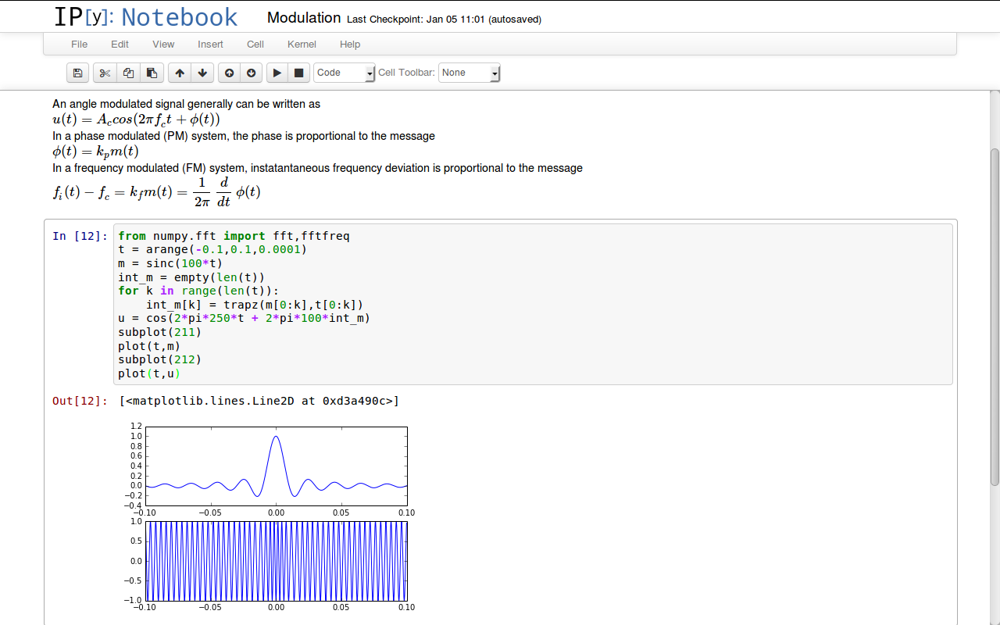
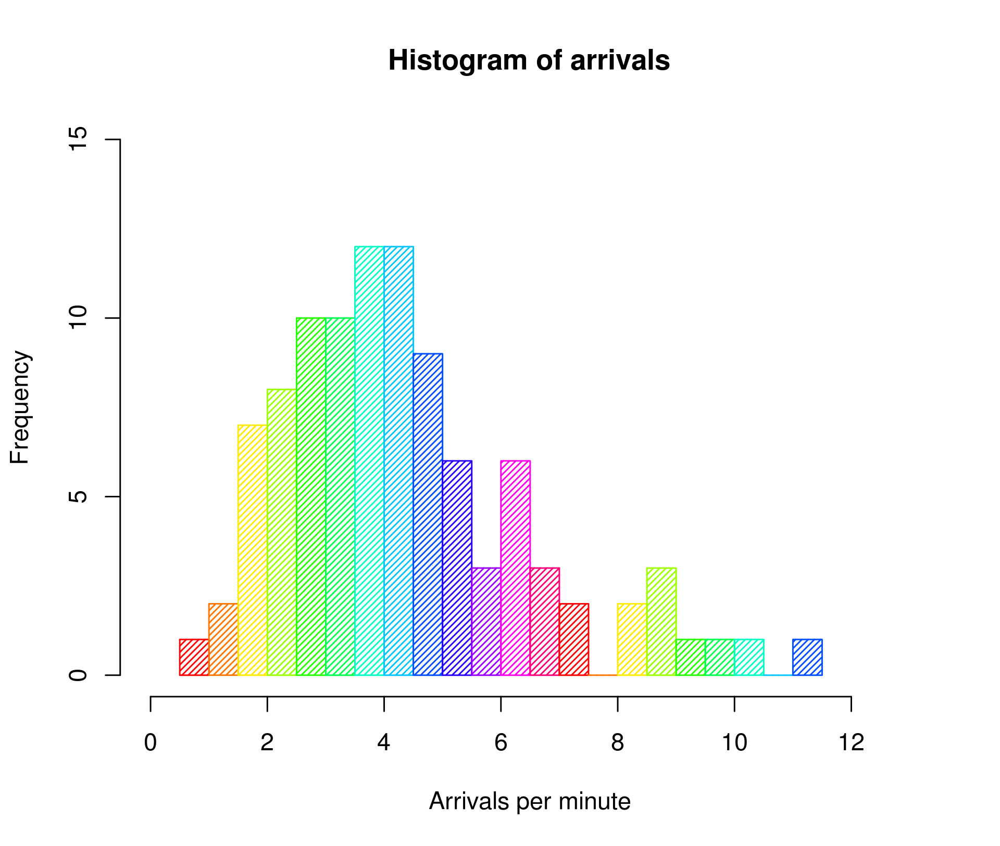

# minicurso de seleccion

El presente son los apuntes asociados al curso de fundamentos exsigido por IBM, el cual es obligatorio para participar
por la Beca completa del Bootcamp ade analitica de datos.

se deben desarrollar las siguientes tareas con una duracion de 16hrs

## crear la cuenta en credly

ya la tenia <https://www.credly.com/users/ojsilvera/badges>

A continuacion el desarrollo de los modulos obligatorios como prerequisito para participar por la beca.

## Explorar tecnologia emergente

### Ciencia de datos (datos y análisis)

#### Que es la ciencia de datos?

##### Todo es cuestión de información

**Exploremos la ciencia de datos.**

Nuestro mundo es rico en datos . Los científicos de datos dan sentido a los datos y los utilizan para resolver problemas.

Antes de profundizar, intente esta pregunta de preparación. Si no sabes la respuesta, haz tu mejor estimación. Aquí va...

¿Crees que los “datos no estructurados” son:

    - Aún no organizado
    - Imposible de analizar
    - Difícil de encajar en una mesa.
    - Inútil

Tenga en cuenta su mejor suposición. ¡Encontrarás la respuesta más adelante en este módulo!

Para comenzar con la ciencia de datos, aquí hay un video breve que explora el campo desde diferentes perspectivas.

<https://youtu.be/f9AqD83qHGg>

##### Como manejas los datos?

**Puedes organizar los datos de dos maneras diferentes.**

Los datos son información cruda. Pueden ser hechos, estadísticas, opiniones o cualquier tipo de contenido registrado en
algún formato. ¿Números? Seguro. ¿Hechos? Seguro. ¿Voces, fotos, nombres, pasos de baile? También datos.

Entonces, cuando los científicos de datos manejan información en bruto para descubrir su historia, comienzan por organizarla
en una de dos formas:  datos estructurados o datos no estructurados . La diferencia entre estas formas cambia la forma en
que trabajamos con ellas.

*Datos estructurados.*

Los datos estructurados son información que se puede distribuir en filas y columnas. Es posible que ya haya trabajado con
datos estructurados utilizando una hoja de cálculo como Microsoft Excel. Para información compleja, los científicos de datos
utilizan herramientas más potentes como SQL, Apache o R, que pueden clasificar grandes cantidades de datos almacenados en
muchas tablas conectadas. ¿Puedes organizar la información dentro de los datos en grupos según características específicas?
Esos grupos son datos estructurados.

A continuación se muestra una muestra de datos estructurados de su ferretería local.

Esta tabla organiza la información del cliente de la ferretería por características como número o nombre del cliente. Cada
fila muestra información relacionada con un cliente en particular, mientras que cada columna muestra una característica del
cliente que abarca un grupo de clientes.

Como puede ver, los datos estructurados tienden a estar bien organizados, lo que facilita a los científicos de datos
descubrir su tesoro utilizando herramientas comunes de análisis de datos. Las hojas de cálculo se basan en tablas como esta,
por lo que manejan muy bien datos estructurados.

*Datos no estructurados.*

Luego están los datos no estructurados, que es una forma elegante de decir "todo lo demás". Usamos este término cuando los
datos no tienen una organización (o estructura) incorporada. Los datos no estructurados pueden ser una colección de archivos
de audio, publicaciones en redes sociales, textos de ensayos o incluso letras de canciones.

Aquí hay dos ejemplos para ayudarle a ver la diferencia:

Su Departamento de Vehículos Motorizados toma fotografías de todas las personas que obtienen una licencia de conducir. Una
colección de esas imágenes son  datos no estructurados . (Pero la tabla de nombres, direcciones y números de licencia de las
personas que indexa esas fotos son datos estructurados).

Una biblioteca descargable puede ofrecer texto de miles de libros diferentes. El catálogo que enumera los nombres, autores y
fechas de esos libros son datos estructurados . (Pero el texto de esos libros son datos no estructurados).

Puede ser más difícil trabajar con datos no estructurados que con datos estructurados, ¡pero sigue siendo útil! Supongamos
que una empresa de videojuegos recibe muchos informes de errores por correo electrónico sobre un nuevo lanzamiento. El texto
de esos correos electrónicos son datos no estructurados. Al examinar esos textos (y tal vez al convertir parte de su
contenido en datos estructurados), un científico de datos puede descubrir patrones e identificar el problema para que la
empresa pueda solucionarlo.

##### Como convertirse en cientifico de datos?

**Cuál es el camino hacia este campo?**

En un tema anterior, viste a jóvenes profesionales hablar sobre ciencia de datos. ¿Notaste que nadie llegó a este campo de
la misma manera? Esto se debe a que la ciencia de datos es un estudio emergente que no se ha definido claramente hasta hace
poco. (Y, en algunas áreas, la definición todavía está cambiando).

Es útil pensar en la ciencia de datos como una creación de conocimiento a partir de datos , sin importar qué técnica se
utilice para analizar los datos. Es como una búsqueda del tesoro. Comienza con texto sin formato, números, gráficos o
cualquier otro tipo de datos, y explora esos datos para descubrir patrones e ideas valiosas.

Ninguna certificación o conjunto de habilidades especiales lo califica como científico de datos. Simplemente comience a
analizar datos en cualquiera de sus muchas formas. Si utilizas técnicas científicas para derivar información de los datos,
eres un científico de datos, ¡sin importar cómo ingresaste al campo! Pero hay áreas de estudio que pueden ayudarle a
prepararse para buscar tesoros de datos y las veremos más adelante en este curso.

En el siguiente video, aprenderá cómo los diferentes caminos pueden llevarlo a este destino profesional.

<https://youtu.be/tM88Bo5S83s>

##### ¿Te gustará el trabajo? cazando tesoros

**Es una búsqueda de comprensión.**

El siguiente vídeo proporciona un sólido punto de vista sobre las cualidades que debe tener un científico de datos, incluida
la curiosidad, la pasión y la capacidad de contar una historia.

<https://youtu.be/hpapzldt6DE>

*¿Podrías ser un científico de datos?*

Ahora que sabes más sobre ciencia de datos y cómo es el trabajo, ¿es esta una carrera que te gustaría explorar?

Descúbrelo respondiendo algunas preguntas.

¿Qué te apasiona? Escribe un campo de estudio, un pasatiempo o algún otro tema sobre el que te interese aprender más.
Recuerde, desde el fútbol hasta la astrofísica, la música y la ayuda tras los huracanes, hay datos en todo.

A mi edad(41 años) podria decir que el sector financiero o los negocios, pero mi pasion está realmente en los videojuegos
y en general la industrias del entreteniemiento que son capaces de crear mundos "ficticios", los cuales nos brindan
una vision alternativa de nuestra propia realidad.

¿Qué datos podrían estar relacionados con sus intereses? Escribe ejemplos de lo que crees que existe.

Desde metricas de intercambio de informacion en la infraestructura que soporta al videojuego, hasta imagenes, videos,
metricas de interacciones por parte de los jugadores, los datos de los propios juagdores o datos del negocio en si mismo,
tales como cantidad de jugadores, venta stotales relizadas, impactos de los lanzamientos, como se comportan los jugadores
en temporadas altas o bajas de acuerdo a las ocupaciones y epocas en la vida diaria, etc, este sector al igual que los
demas ofrece una alta cantidad de datos para analizar.

¿Están esos datos en su mayoría estructurados, de modo que pueda enumerarlos en filas y columnas ordenadas? ¿O es en su
mayor parte no estructurado, como archivos de texto o multimedia?

Creo que es un mixto de datos estruturados, tales como nombre del dueño de la cuentas, compras realizadas, items, etc Y
datos no estructurados, como videos de cinematicas, imagenes de items, imagenes de logros realizados por cada jugador, etc

Intente hacer una pregunta (¡o dos, o tres!) que se relacione con su área de interés y los datos que podrían describirla.

Cuantos jugadores hemos alcanzado en el perido de lanzamiento reciente? los datos que la describen es la cantidad de jugadores
interactuiando simultaneamente en el momento del lanzamiento, esto de acuerdo a la regien en caso de ser un juego a nivel
mundial, soerian datos estructurados al relacionarlos por zonas y obtener un total.

Cuantas compras han sido realizadas en el juego durante un periodo de timpo determinado? estos datos sin duda son estructurados
ya que involucran la relacion entre la cuenta y las diferentes compras realizadas en la plataforma, que nos permite evaluar la
viabilidad financiera del titulo en cuention, en un periodo determinado, logrando estrablecer metas y objetivos que apoyen
a la organizacion.

Cuanta interaccion generan las cinematicas en el ineterior del juego? las cinematicas al ser fracmentos de videos son datos
no estructurados, pero al relacionarlos con el cliente del juego que los reproduce, que tantos saltaron la cinematica o la
repodujeron completa, pasarian a ser un resultado estructurado.

La funcion de captura es utilizada por los jugadores? el dato referente a esta pregunta se basa en una caracteristica que
genera datos no estructirados, pero al relacionarla con el uso que los jugadorres les dan y con que frecuencia la utilizan,
pasan a ser datos estructurados, que nos permiten inferir los intereses de los jugadores y si algunas caracteristicas
merecen o no continuar en el juego y por lo tanto seguir invirtientoles tiempo y recursos valiosos para la organizacion

##### La ciencia de datos como carrera, Infografía

**Carreras en ciencia de datos.**

La ciencia de datos es un campo en rápido crecimiento con muchas oportunidades para mentes curiosas. Ahora quizás se
pregunte qué industrias se centran más en la ciencia de datos, qué habilidades técnicas podrían estar en demanda o cuáles
son los trabajos interesantes en este campo. La respuesta a estas preguntas, además de algunos datos más, se incluyen en la
siguiente infografía.

#### Técnicas para gestionar, compartir y poner datos a trabajar

##### Introduccion

*Hacer las cosas con ciencia de datos.*

Después de aprender sobre qué es la ciencia de datos en ¿Qué es la ciencia de datos? módulo, ahora es el momento de explorar
cómo se hace.

En este módulo, aprenderá sobre algunas de las herramientas y técnicas que utilizan los científicos de datos para encontrar
los conocimientos que contienen los datos. Esto incluye aprender cómo explorar datos en bases de datos relacionales, cómo
comunicar datos visualmente y cómo la ciencia de datos y el aprendizaje automático se unen para proyectar el futuro.

##### Ordenar datos para el analisis, Gestionando tus datos

**¿Que es una base de datos?**

Casi todos los científicos de datos dedicarán tiempo a trabajar en una base de datos , que es una colección organizada de
datos estructurados en un sistema informático. (Recuerde, los datos estructurados generalmente se organizan en formato de
tabla con filas y columnas, como el siguiente ejemplo).

La mayoría de las bases de datos actuales están organizadas como bases de datos relacionales, que son colecciones de múltiples
conjuntos de datos o tablas que se vinculan entre sí.

Por ejemplo, una tabla puede enumerar nombres y direcciones, mientras que la otra puede enumerar propiedades y sus
propietarios. Si algunos de los propietarios también aparecen en la tabla de nombres y direcciones, las dos tablas se pueden
vincular, creando una base de datos relacional.

Los sistemas de gestión de bases de datos relacionales (RDMS) ayudan a los científicos de datos a correlacionar información
de todas las tablas dentro de la base de datos, cambiar datos relacionados o agregar y eliminar datos en la base de datos
sin romper su estructura.

**Utilice una base de datos para almacenar y ordenar datos.**

La mayoría de los sistemas de gestión de bases de datos utilizan algún tipo de lenguaje de consulta estructurado, o SQL,
para hacer preguntas o "consultar" la base de datos o modificar su contenido. SQL es increíblemente útil y es algo que
puedes aprender a través de un libro, un curso en línea o un club de informática. Vamos a ver cómo funciona.

Suponga que tiene un millón de filas de datos en una tabla de votantes registrados en su estado. (¡Muchas bases de datos son
así de grandes, o incluso más grandes!) La tabla contiene información sobre el lugar de votación, la afiliación partidista y
la edad de cada votante. Si solo quisiera obtener la información de todos los votantes menores de 21 años, podría escribir
una consulta en SQL que realice una búsqueda simple. Se vería así:

Sí, una simple búsqueda podría haber respondido a esta pregunta en particular. Sin embargo, si desea descubrir votantes que
viven en un área geográfica particular para poder estudiar la frecuencia con la que personas de diferentes edades de ese
grupo acuden a las urnas, su consulta abrumará una simple búsqueda. ¡Pero SQL puede hacer el trabajo!

Si bien SQL es el lenguaje subyacente que impulsa la mayor parte del trabajo realizado en bases de datos relacionales,
existen muchos RDBMS en los que puede realizar ese trabajo. A medida que se aventure en este campo, se encontrará con
nombres como estos:

        mysql
        acceso Microsoft
        PostgreSQL
        Oráculo
        DB2
        MongoDB

**Elija las herramientas adecuadas para gestionar los datos.**

¿Por dónde empiezas? ¡Existen docenas de herramientas y plataformas útiles de ciencia de datos! Aquí hay una lista de
algunas plataformas populares y de código abierto que puede utilizar para comenzar su propio viaje en ciencia de datos.

*R es un buen lugar para comenzar.*

R es un lenguaje de programación y un entorno de software gratuito que se utiliza a menudo para análisis estadístico y
ciencia de datos. Muchos aspirantes a científicos de datos comienzan con esta herramienta o con una de las interfaces R
populares, y hay cientos de paquetes útiles en R que ayudan con la visualización de datos como ggplot2.

Así es como se ve RStudio. Es una interfaz popular para trabajar en R.

*Python funciona para propósitos generales.*

Python es un lenguaje de programación popular de propósito general que también se puede utilizar para la ciencia de datos.
Combínelo con una biblioteca como  la biblioteca pandas y con una interfaz útil, y Python puede ayudarlo a crear nuevos
conocimientos y visualizaciones de datos.

Así es como se ve Python en la interfaz de una computadora portátil.

*MATLAB ayuda a hacer números.*

MATLAB fue creado para centrarse en la computación numérica. Se utiliza a menudo en la educación superior.

*Apache Spark admite big data y aprendizaje automático.*

Apache Spark es un marco patentado de propósito general que puede resultar especialmente útil para conjuntos de datos
extremadamente grandes y el aprendizaje automático que los utiliza.

##### Visualizar datos para comunicarlos, Compartiendo tus resultados

**Visualiza tus datos.**

¿De qué sirven los datos si no se pueden comunicar de manera que la gente los entienda? Los científicos de datos utilizan
visualizaciones como gráficos o mapas para ayudar a las personas a comprender el significado de los datos. Si se usan
correctamente, estas herramientas pueden aportar claridad y simplicidad a cuestiones complicadas.

*Utilice gráficos para estadísticas.*

Los gráficos y cuadros son una excelente manera de arrojar luz sobre estadísticas confusas o información en tablas.

*Utilice mapas para las relaciones.*

Hay muchos tipos de gráficos y tablas, como el histograma que se muestra arriba, e incluye diagramas de dispersión,
diagramas de barras, diagramas de caja y muchos más.

Los mapas son una excelente manera de expresar datos que se pueden presentar como áreas en dos dimensiones. Funcionan bien
no sólo para la geografía, sino también para relaciones como la popularidad de la marca, las preferencias musicales o
incluso las redes eléctricas municipales.

**Elija la herramienta adecuada para la visualización de datos.**

Puede crear visualizaciones de datos simples, como cuadros o gráficos, en la mayoría de los programas de hojas de cálculo.
Pero a medida que los datos se vuelven más complejos, recurrirá a otras herramientas. Algunos se venden como productos de
visualización independientes, mientras que otros son complementos de los sistemas de gestión de datos.

También encontrará excelentes libros, impresos y en línea, que lo ayudarán a hacer que sus visualizaciones sean más útiles.
Aquí tienes una pista: *¡mira el trabajo de Edward Tufte, un maestro de la visualización!*

*Tableau crea visualizaciones interactivas.*

Tableau puede ayudarle a crear visualizaciones interactivas sin escribir código. Muchas organizaciones en línea lo utilizan,
lo que lo convierte en una excelente herramienta para explorar.

*ggplot2 ayuda con datos complejos.*

Una de las herramientas de espacio de trabajo de R más populares es ggplot2, que puede ayudar a visualizar datos que son
demasiado complejos para otros programas menos sólidos.

*Matplotlib funciona bien con Python.*

Matplotlib es una herramienta de visualización popular que funciona con el lenguaje de programación Python. Ayuda a los
programadores a crear cuadros, gráficos y mapas en muchos formatos diferentes.

**¿Puede la visualización de datos describir tu propia pasión?**

En el ¿Qué es la ciencia de datos? En el módulo, exploraste la idea de algo que te apasiona y cómo se podrían aplicar los
datos a ese campo. Ahora, intenta entrar en la web y encontrar una visualización de datos que se aplique a tu pasión.

Podría ser un mapa de algún tipo, un cuadro, una gráfica o alguna otra imagen que ayude a expresar datos de una manera
diferente a una simple tabla. Después de buscar, tómate un tiempo para anotar qué tipo de visualización de datos has
encontrado.

Yo he encontrado cuantos jugadores he tenio un videojuego como last epoch desde el dia de s lanzamiento hasta la fecha, en
steam charts se muestra la grafica, es un tipo de grafico de linea que muestra cuantos jugadores ha tenido el juego en
simultaneo en marcos de tiempo predeterminados, horas, dias, semanas o años, mostrando los picos de mayor trafico y como
estos disminuyen de acurdo a ciertas situaciones en especifico, lanzamientos, actualizaciones o parches, caidas de
servidores, etc.

##### Utilice datos para impulsar el aprendizaje automatico

**¡Las máquinas pueden aprender!**

Durante muchos años, las computadoras sólo podían hacer cálculos matemáticos o ejecutar programas paso a paso de acuerdo con
reglas específicas. Pero hoy, la inteligencia artificial , o IA, ha cambiado las reglas del juego. Ahora, los sistemas no
vivos pueden, al igual que los sistemas vivos, sentir su entorno y tomar decisiones en pos de sus objetivos.

¡El aprendizaje automático  permite esta asombrosa habilidad! Los seres humanos están empezando a crear sistemas
informáticos que pueden aprender por sí solos, sin programas paso a paso ni reglas específicas. Los sistemas de aprendizaje
automático ya nos ayudan en la vida cotidiana. Considere, por ejemplo, lo que sucede cuando alguien de su familia toma una
fotografía de un cheque con su teléfono inteligente para realizar un depósito bancario. El aprendizaje automático ha
enseñado a los sistemas del banco cómo leer la letra de ese cheque y comprender su significado.

Aquí hay otro ejemplo. Hoy en día, cuando alguien con cáncer visita a un médico, ese médico puede mostrar en pantalla un
conjunto detallado de posibles tratamientos, cada uno de ellos basado en investigaciones actualizadas y completo con una
evaluación de la probabilidad de que funcione para ese paciente en particular. El médico toma la decisión, pero es la
máquina, que aprende cada vez más sobre el cáncer leyendo miles de informes de investigación tan pronto como se publican, la
que recomienda tratamientos probables.

**La ciencia de datos impulsa el aprendizaje automático.**

¿Se pregunta por qué lee sobre IA en un curso de ciencia de datos? Porque el aprendizaje automático requiere enormes
cantidades de datos y la capacidad de extraer significado de esos datos. ¡Eso es ciencia de datos a gran escala! Los
científicos de datos de hoy utilizan algoritmos y técnicas de aprendizaje automático para extraer información de los enormes
almacenes de datos del mundo.

Aquí hay dos ejemplos de lo que podríamos aprender cuando el aprendizaje automático desglosa grandes cantidades de datos:

    La regresión explora cómo cambiará un conjunto de hechos o números cuando cambien otros factores o números relacionados,
    Por ejemplo, el aprendizaje automático puede estimar el precio de venta apropiado de una casa nueva en función de las
    ventas de otras casas similares en el área.

    La clasificación identifica grupos ocultos dentro de conjuntos de información aparentemente aleatorios. Por ejemplo, el
    aprendizaje automático puede mirar videos de miles de cámaras en las esquinas de las calles y rastrear los caminos seguidos
    por personas de un género, raza o apariencia en particular.

Aplicaciones como estas serían imposibles sin el poder de la ciencia de datos moderna.

#### Ciencia de datos en el mundo real

##### Trabajar con datos, Un día en la vida

**¿Cómo es trabajar con datos?**

Exploremos cómo son las carreras en ciencia de datos y cuáles son las oportunidades laborales. Analizaremos algunas
aplicaciones de la ciencia de datos en el mundo real. Luego profundizaremos en los trabajos de ciencia de datos y las formas
en que las empresas utilizan los datos.

Básicamente, el trabajo de un científico de datos es analizar grandes cantidades de información sin procesar para encontrar
patrones. Eso podría significar preprocesar datos, construir modelos para analizar esos datos o presentar información
utilizando técnicas de visualización de datos. La ciencia de datos siempre se trata de extraer información valiosa de los
datos.

##### Aplicando la ciencia de datos, ¿Para qué sirve?

**¿Cómo aplicamos la ciencia de datos?**

Desde cosas simples como la búsqueda de Google, los juegos y el desarrollo de productos hasta aplicaciones futuristas como
la realidad aumentada y la publicidad predictiva, la ciencia de datos ofrece beneficios a casi todas las industrias.

En el siguiente video, escuchará a varios jóvenes científicos de datos discutir posibles aplicaciones de la ciencia de datos
y algunas preocupaciones éticas sobre cómo se podrían aplicar sus hallazgos.

<https://youtu.be/LITpRGbrDkM>

##### ¿Cómo es ser científico de datos en IBM?, Empleos del mundo real

**Caminos apasionantes para los científicos de datos.**

IBM emplea científicos de datos en una variedad de campos, desde análisis de salud hasta energía y finanzas. El objetivo de
la ciencia de datos es ayudar a analizar tendencias para tomar mejores decisiones ante los desafíos comerciales. Estos
especialistas descubren patrones en los datos, los visualizan, los utilizan para resolver problemas y crean algoritmos para
convertir los datos en acción.

Escuche estas entrevistas con científicos de datos profesionales.

<https://youtu.be/CqcEW-jyDmo>

##### La ciencia de datos y tú

Algunas actividades para explorar más la ciencia de datos, Pruebe las siguientes actividades para ver cómo la ciencia de
datos podría aplicarse a su vida e intereses.

**¡Hacer una pregunta!**

Piense en una pregunta interesante que pueda responderse con datos. Aquí hay unos ejemplos:

¿Cuántos adolescentes viven en mi ciudad?
¿Cuál es el promedio de asistencias por partido de los bases en la NBA?
¿Qué canción pop se ha escuchado más en los últimos seis meses?
La pregunta puede ser cualquier cosa que quieras, siempre que te interese y puedas responderla si tienes los datos correctos.

**¡Reúne algunos datos!**

A veces lo primero es una pregunta. Otras veces, los científicos de datos encuentran un conjunto de datos que parece
interesante y luego lo exploran. Si no tienes la pregunta perfecta, ¡no te preocupes! Tu próximo paso podría ser encontrar
algunos datos interesantes sobre tu pasión. Eso podría generar varias preguntas interesantes.

Muchas industrias tienen datos disponibles públicamente en la web. Ya sea que te gusten los deportes, la música, la moda, el
arte, la salud, los juegos o cualquier otra cosa, comienza a buscar tablas que contengan datos estructurados que puedas
explorar.

**¡Pruebe una herramienta!**

¿Quizás una herramienta en particular despertó su interés? ¿Quizás le gustaría comenzar a crear gráficos usando R o siempre
quiso aprender más sobre Python? ¿O tal vez tiene su pregunta y sus datos y está listo para comenzar a utilizar técnicas
avanzadas para obtener información?

Continúe y experimente utilizando una de las herramientas de ciencia de datos disponibles públicamente de las que hablamos
en el módulo anterior. Importe una tabla a una herramienta, cree un gráfico o realice otro curso sobre un software.
¡Aprenderás (y harás) más mientras intentas trabajar en algo!

**¡Lee un blog!**

Los blogueros de IBM son un gran recurso para obtener una perspectiva más profunda de la ciencia de datos. Vuelva a
consultar de vez en cuando para ver temas sobre big data y análisis en acción en todo el mundo en el sitio Cloud Computing
News de IBM.

### Cloud computing

#### Que es cloud computing?

#### Como se utiliza el cloud computing?

### Inteligencia Artificial (IA)

### Ciberseguridad

### Blockchain

### Internet de las cosas (IoT)

## Explorar metodologias agiles

## Panorama laboral
